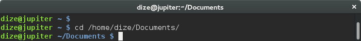
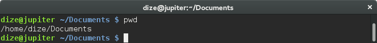
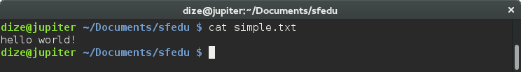
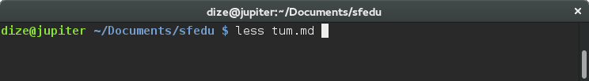
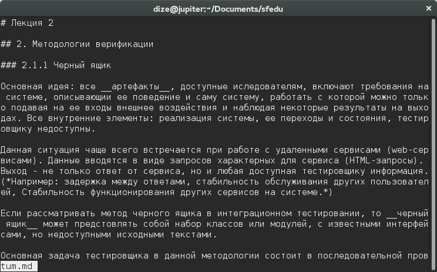
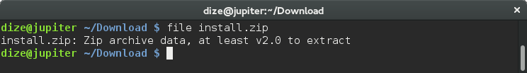

# Основные команды Bash

## Перемещение по файловой системе и работа с ней.

### 1. cd
```bash
  cd </path/to/directory>
```

Сокращенное *change directory*. Позволяет перемещаться по файловой системе.

Путь может быть как абсолютным (*начмнаться с /*), так и относительным (*подразумевается расположение пути относительно текущего*).



* __cd__ без параметров перемещает в домашнюю директорию пользователя.
* __cd -__ перемещает по прошлому пути.
* __.__ (точка) текущая директория
* __..__ (две точки) родительская директория
* __~__ (тильда) домашняя директория пользователя

### 2. pwd

```bash
  pwd
```

Cокращение от *print work directory*. Выводит текущий абсолютный путь.



### 3. ls

```bash
  ls </path/to/directory>
```

Сокращение от list.
Отбражает все **файлы** и **директории** в директории </path/to/directory>.


* __ls__ без параметров отображает все файлы и директории по **текущему** пути
* __ls -a__ отображает скрытые файлы и папки
* __ls -l__ отображает расширенную информацию о файлах и папках

### 4. cat

```bash
  cat <file_name>
```

Отображает содержимое файла file_name.



### 5. less

```bash
  less <file_name>
```

Отображает содержимое файла file_name, выводит только содержимое помещающееся в окно терминала.
Навигация по файлу возможна **клавишами-стрелками**, кнопка "q" закрывает просмотр.





### 6. file

```bash
  file <file_name>
```

Выводит на экран тип файла. Настоящий тип, а не указанный в расширении.



### 7. cp

```bash
  cp <file1> <file2>
```
Сокращение от __copy__.
Копирует файл __file1__ по пути __file2__.

### 8. mv

```bash
  mv file1 file2
```
Сокращение от __move__.

Перемещает файл __file1__ по пути __file2__.

### 9. rm

```bash
  rm <file1>
```
Сокращение от __remove__.

Удаляет файл __file1__.

* __rm -r__ удаляет директорию

### 10. mkdir

```bash
  mkdir <directory>
```
Сокращение от __make directory__.

Создает директории с именем __directory__.

### 11. locate

```bash
  locate <file>
```

Возвращает все пути с вхождениями __file__ в них.

### 12. man

```bash
  man <cmd>
```
Отображает справку по команде __cmd__.

### 13. echo

```bash
  echo <string>
```
Выводит заданную строку __string__ на экран.

### 14. strings

```bash
  strings <file1>
```
Выводит все строки с печатными символами из файла __file1__ на экран.

## Перенаправление вывода

Bash позволяет перенаправлять стандартный вывод в файлы с помощью оператора **>**.
Если файл не существовал, он будет создан, иначе он будет перезаписан.

```bash
$ echo hello! > 1.txt
$ ls
1.txt
$ cat 1.txt
hello!
```
Если требуется *дописать* строку в файл используется оператор **>>**.

## Конвейер

Если нужно перенаправить вывод одной команды на вход другой используется оператор **|**.
```bash
  $ locate bin | less
```

## Поиск по содержимому файлов

```bash
  $ grep [opts] "pattern" file
```

```bash
  $ cat file | grep [opts] "pattern"
```

__-v__ - вывести строки, где не всречается образец  
__-i__ - игнорировать регистр символов  
__-n__ - печатать номера строк  
__-a__ - искать по бинарным файлам  
__-E__ - расширенные регулярные выражения  
__-o__ - вывести только совпадающую с образцом часть строки  

## Регулярные выражения

```bash
  $ egrep [opts] "pattern" file
```

```bash
  $ cat file | egrep [opts] "pattern"
```

`^` `"^license"` - начало строки  
`$` `"license$"` - конец строки  
`[abc]` `"[0-9]"` - любой символ из перечисленных  
`[^abc]` `"[^ ]1"` - любой кроме перечисленных  
`[ab]{8}` `"w{3}"` - повторяется несколько раз  
`(abc)` `"(license)"` - группа символов  
`.` `"Li.en.e"` - любой символ  
`*` `"\([a-z ]*\"` - повторить ноль или больше раз  
`+` `"\(a.+\)"` - повторить один или больше раз  
`?` `"(copy)?right"` - повторить ноль или один раз  

## Обработка текста

Вывести символы со 2 по 5 каждой строки
```bash
  $ cat file | cut -c 2-5
```

Отсортировать строки по алфавиту
```bash
  $ cat file | sort
```

Удалить одинаковые строки, идущие подряд
```bash
  $ cat file | uniq
```

Вывести уникальные строки
```bash
  $ cat file | sort | uniq
```

```bash
  $ cat file | awk 'program'
```
`'{print $0}'` - вывести каждую строку
`'{print $1}'` - вывести первое слово каждой строки
`'{print "1: " $1 ", 2: " $2}'` - вывести для каждой строки 1:<слово 1>, 2:<слово 2>