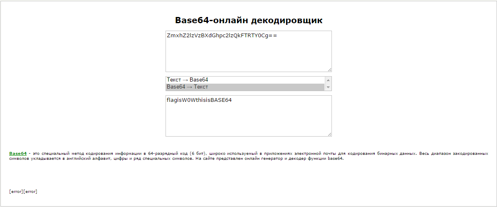
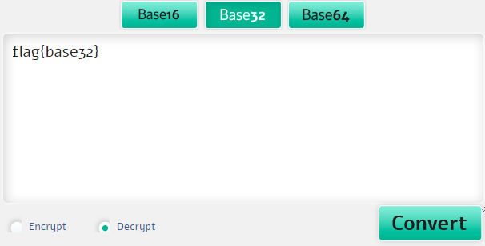
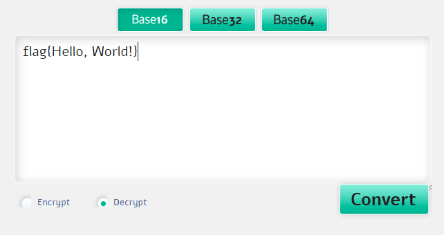
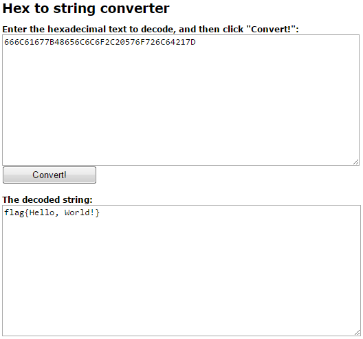

# Мануал по методу кодирования base 16/32/64.

## История появления кодировки.

Кодировка base берет свое начало еще с тех времен, когда не было определено сколько бит должно содержаться в одном байте. Сейчас всем известно, что в одном байте содержится 8 бит и с помощью него можно закодировать 256 различных значений, но так было не всегда.

Раньше были популярны кодировки, содержащие 6, 7 или 8 бит в байте. Таким образом, 6 бит позвояло закодировать в одном байте 64 различных значения, а 7-ми битная кодировка 128 значений. Казалось бы, что этого достаточно для того, чтобы закодировать буквенно-цифровой алфавит. Но вскоре была принята кодировка, содержащая 8 бит в одном байте.

Такая кодировка привнесла много проблем. В первую очередь, эти проблемы были связаны с оборудованием, которое уже работало на других кодировках, где байт содержал 6 или 7 бит. Но помимо этого была проблема обрезания 8-го бита в системах электронной почты, т.к. весь сфот был заточен под 7-ми или 6-ти битную кодировку. Как пример, 7-ми битная кодировка могла спокойно обнулить каждый 8-ой бит, что приводило к потери данных.

Тут на помощь пришел base 64.
Идея base64 проста — обратимое кодирование, с возможностью восстановления, которое переводит все символы восьмибитной кодовой таблицы в символы, гарантированно сохраняющиеся при передаче данных в любых сетях и между любыми устройствами.
В основе алгоритма лежит сведение трех восьмерок битов (24) к четырем шестеркам (тоже 24) и представление этих шестерок в виде символов ASCII. Таким образом получается обратимое шифрование, единственным недостатком которого будет увеличивающийся при кодировании размер — в соотношении 4:3.

Ниже приведена схема смещения битов в base 64  

**Пример:**

Возьмем русский текст «АБВГД». В двоичной форме в кодировке *Windows-1251* мы получим 5 байтов:
11000000
11000001
11000010

11000011
11000100
(00000000) — лишний нулевой байт нужен, чтобы общее число бит делилось на 6

Разделим эти биты на группы по 6:
110000
001100
000111
000010

110000
111100
010000
000000

Берем массив символов «ABCDEFGHIJKLMNOPQRSTUVWXYZabcdefghijklmnopqrstuvwxyz0123456789+/» и получившиеся числа переводим в эти символы, используя их, как индексы массива, получаем «wMHCw8Q». Остается только добавить в конце один символ "=", как указание на один лишний нулевой байт, который мы добавляли на первом шаге и получить окончательный результат:
«АБВГД»: base64 = «wMHCw8Q=»
Возможно и обратное преобразование.

## Base 16
Base 16 - это система счисления по основанию 16, т.е шестнадцатиричная система счисления. С ней вы могли и должны были столкнуться на уроках информатики.
Алфавит этой кодировки состоит из цифр (0-9) и букв (A-F).
Алгоритм преобразования остается примерно тем же, разве что теперь нам надо исходные двоичные числа разделить на тетрады (группы по 4 бита) и перевести их в соотвествии с таблицой кодировки в символы ASCII.

## Base 32
Base 32 использует 32 символа: A-Z (или a-z), 2-7. Может содержать в конце кодированной последовательности несколько спецсимволов (по аналогии с base64).
В данном алгоритме преобразования нам необходимо будет разделять двоичные значения на группы по 5 бит.

## Основные отличия кодировок
### Base64

Позволяет кодировать информацию, представленную набором байтов, используя всего 64 символа: A-Z, a-z, 0-9, /, +. В конце кодированной последовательности может содержаться несколько спецсимволов (обычно “=”).

* Преимущества:
Позволяет представить последовательность любых байтов в печатных символах.
В сравнении с другими Base-кодировками дает результат, который составляет только 133.(3)% от длины исходных данных.

* Недостатки:
Регистрозависимая кодировка.

### Base32

Использует только 32 символа: A-Z (или a-z), 2-7. Может содержать в конце кодированной последовательности несколько спецсимволов (по аналогии с base64).

* Преимущества:
Последовательность любых байтов переводит в печатные символы.
Регистронезависимая кодировка.
Не используются цифры, слишком похожие на буквы (например, 0 похож на О, 1 на l).

* Недостатки:
Кодированные данные составляют 160% от исходных.

## Как закодировать/декодировать base?
В основном в заданиях по ctf вам будет попадаться base 64. Его легко определить, т.к. на конце будет знак "=". Например, мы кодировали строку «АБВГД» в base 64 и у нас получился результат «wMHCw8Q=». Как мы видим, здесь присутсвует знак "=", который говорит нам о том, что строка зашифрована в base 64.

Итак, как же ее декодировать?
Все очень просто. Base 16, 32, 64 легко декодировать онлайн-сервисами. Т.е. вбиваете в гугле подобный запрос:"base 64 online decoder" и вам будет выдан большой перечнь ссылок на онлайн декодеры. Берем первый попавшийся, разве что для уточнения стоит воспользоваться сразу несколькимим онлайн декодерами.

Процесс кодирования почти ничем не отличается, разве, что вам нужно вбить в запросе не "decode", а "encrypt". Бывает, что нужно обращать внимание на то, какой кодировкой вы пользуетесь. В русскоязычной версии ОС "Windows" обычно используется кодировка windows-1251.

# Практика
## Задание 1:
Взгляните на эту строку:  
ZmxhZ2lzVzBXdGhpc2lzQkFTRTY0Cg==

На конце мы видим "=", причем двойное, что сразу наводит на мысль, что это base 64.
Воспользуемся онлайн-декодером.  

В ответе мы видим расшифрованную строку - это и есть наш флаг:  
flagisW0WthisisBASE64

## Задание 2:  
Посмотрим на эту строку:  
MZWGCZ33MJQXGZJTGJ6Q

На конце мы не видим знака "=". На base 16 тоже не похоже, тогда попробуем base 32.  
Снова воспользуемся онлайн-декодером.  

И вот наш флаг: flag{base32}

## Задание 3:  
Была получена такая строка: 666C61677B48656C6C6F2C20576F726C64217D

Здесь нет ни знака "=", алфавит ограниченный. Похоже на base 16 или просто hex.  
Как и прежде, пользуемся онлайн-декодером.  

Отлично, у нас есть флаг, но это же задание можно было решить и через hex декодер.  

Наш флаг: flag{Hello, World!}

# Ссылки на онлайн декодеры:
Вот несколько ссылок:  
https://www.base64decode.org  
http://base64.ru  
http://pbaseconverter.com
