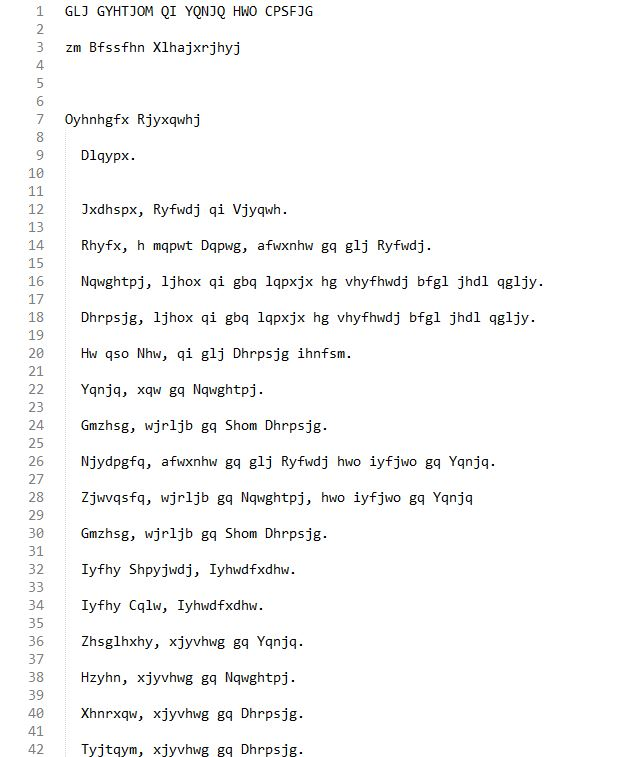
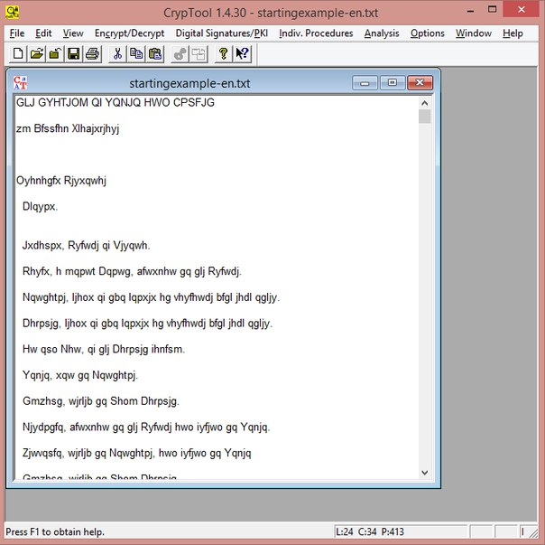
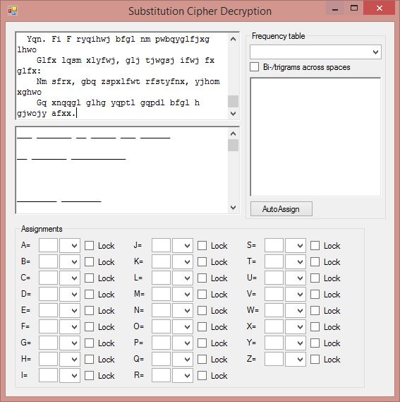
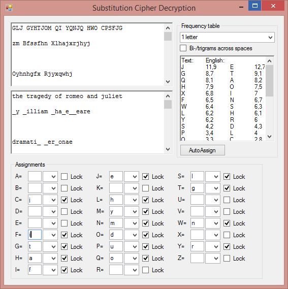
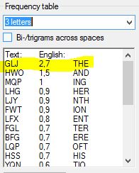
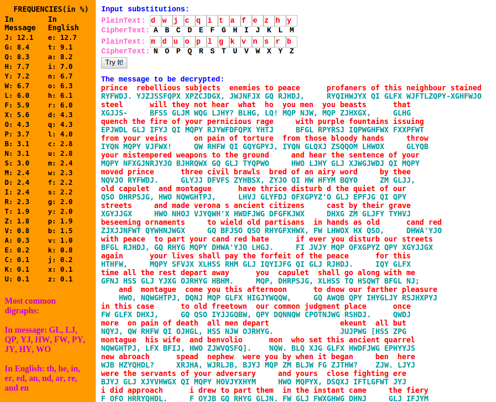
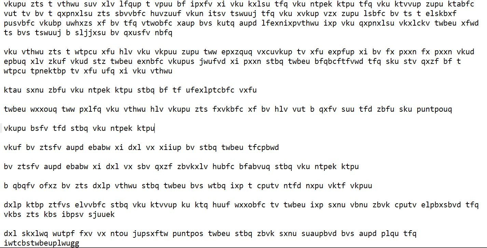
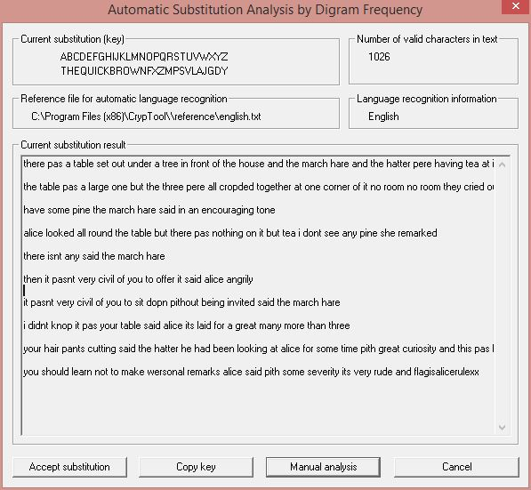

# Шифр простой замены
________
## Теория
>Криптография бывает двух типов: криптография, которая помешает читать ваши файлы вашей младшей сестре, и криптография, которая помешает читать ваши файлы людям из правительства.  
**Брюс Шнайер**  
***Прикладная криптография***

Шифр простой замены, простой подстановочный шифр, моноалфавитный шифр — класс методов шифрования, которые сводятся к созданию по определённому алгоритму таблицы шифрования, в которой для каждой буквы открытого текста существует единственная сопоставленная ей буква шифр-текста. Само шифрование заключается в замене букв согласно таблице. Для расшифровки достаточно иметь ту же таблицу, либо знать алгоритм, по которой она генерируется.

К шифрам простой замены относятся многие способы шифрования, возникшие в древности или средневековье, как, например, Атбаш (также читается как этбаш) или Шифр Цезаря. Для вскрытия подобных шифров используется частотный криптоанализ.

Для вскрытия шифра простой замены используется такой метод криптоанализа как Частотный анализ.

*Частотный анализ —  основывается на предположении о существовании нетривиального статистического распределения отдельных символов и их последовательностей как в открытом тексте, так и в шифротексте, которое, с точностью до замены символов, будет сохраняться в процессе шифрования и дешифрования.*

Частотный анализ предполагает, что каждая буква алфавита того или иного языка в довольно длинном тексте встречается с определенной частотой, к примеру, для русского языка известно, что буквы «О», «П», «Р» встречаются очень часто, а вот «Й», «Ъ» — редко. Как же работает данный метод? К примеру, имеется зашифрованный текст, полученный методом какой-либо перестановки букв по определенному алгоритму, и аналитикам требуется его расшифровать. Для этого берется открытый текст, желательно довольно длинный, затем подсчитывается в нем частота каждой буквы, причем, чем больше будет текст, тем точнее получится расшифровка.

Следующий шаг – то же самое проделывается с зашифрованным текстом, подсчитывается частота каждого символа. Собственно говоря, весь процесс расшифровки сводится к тому, что сопоставляются частоты двух текстов. Например, в открытом тексте буква «О» встречается с частотой 33%, то есть от общего количества букв текста, буква «О» составляет 33%, а в зашифрованном тексте с частотой 33% встречается буква «П», значит, с большей вероятностью под буквой «П» подразумевается «О».

## Практика:  Задание 1##
* Возьмём задание категории Crypto  из репозитория "xairy/mipt-ctf"

 

* Перейдя по ссылке мы получим текст.
 Текст не маленький **153тысячи** символов!!!

 

* Но нам это на руку, чем больше текст, тем с большей вероятностью мы будем угадывать символы.
 ### Метод 1: CrypTool
*  Загружаем текст в CrypTool 1.4

  

* Analysis -> Symmetric Encryption (classic) -> Ciphertext-Only -> Substitution
Дальше программа сама сделает за нас все(Проведет анализ и выдаст исходный текст)

  

* Остается указать автора как флаг

### Метод 2: SubstitutionCipherDecryption
Автором данной статьи на просторах интернета была найдена интересная и удобная(на взгляд автора) программа SubstitutionCipherDecryption.exe
* Загружаем текст в программу

* В правой части мы можем видеть таблицу сравнения частотного анализа текстов на английком языке в общем и конкретно нашего текста(не забываем, что тексты разного характера имеют разные показатели честотной характеристики. Так например в научной статье или художественном произведении шанс встретить одну и ту же букву может отличаться на несколько процентов, что очень много).
Так же мы можем анализировать Двойные сочетания символов, тройные и сочетания из 4 символов.

* При нажатии  "AutoAssign" программа автоматически подставит ОЧЕВИДНЫЕ совпадения. Остальное легче сделать руками. Мы легко можем догадаться, что, допустим, THE - самое частое слово из 3 букв. Т.е. выбрав статистику слов из 3 букв мы сразу увидим очевидную замену

### Метод 3 (От Создателя таска):

* [Используя данный сайт](http://cryptoclub.math.uic.edu/substitutioncipher/frequency_txt.htm)

* После добавления текста он подвергается анализу и выдает схожий с предыдущей программой результат

(т.е. левый столб = частоты нашего сообщения, правый = стандартные частоты)

## Задание 2 (fhq2015 ctf)##
* Информации куда меньше, но прогнав это все в первую очередь через [Цезарь](Цезарь)
и убедившись, что это не он мы приступаем к частотному анализу.

* CrypTool`oм это делается за пару мгновений.

**Подводя итог:**

1. CrypTool - универсальная программа для взлома почти всего, что можно и чего нельзя.
2. SubstitutionCipherDecryption - программа нацеленная исключительно на данный метод шифрования.
3. http://planetcalc.ru/733/ - частотный анализ ***русского*** текста.
4. http://seozor.ru/tools/analyzer.php - семантический анализ текста(поиск сочетаний из 2,3,4 и более букв)
5. [Сайт, указанный автором одного из тасков(удобен за неимением ПО)](http://cryptoclub.math.uic.edu/substitutioncipher/frequency_txt.htm)
