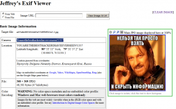
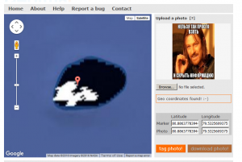
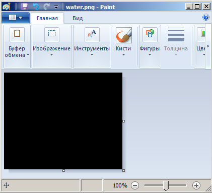
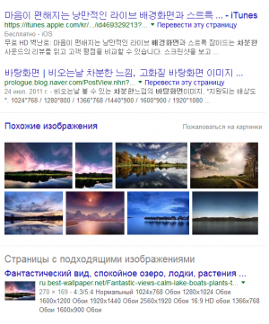

# Работа с изображениями

В этой статье мы поговорим о способе определения метода сокрытия информации в изображениях.

## Общие проверки для BMP/PNG/JMP и других

__Получение exif файлов__  
Первое что обычно я делаю, если не знаю с чего начать - получаю exif файла. Пример:  
Дана картинка:

Последовательность действий:
> 1. Переходим на сайт http://regex.info/exif.cgi
> 2. Отсылаем картинку.
> 3. Замечаем текст Youarethebesthackerihaveeverseen!1337 - это и есть флаг к заданию!

__Получение GEO-тегов__

Аналогичное с EXIF решение, но отсылается файлик на сайт http://www.geoimgr.com/  
В итоге получаем координаты:  

Обычно данные действия требуются в заданиях на форенсику, например популярное задание по фотографии с телефона найти город, где находится воришка.

__Архив__

Изображение может оказаться архивом. Чаще всего это заметно, если картинка весит больше, чем доолжна весить при таких размерах.  
Пример:  
Дано изображение: 

Последовательность действий:
> 1. Переименовать оканчание в .rar/.zip/.7z или в любой другой тип архивов (перебор).
> 2. Попробовать распаковать. 
> 3. При оканчании .rar данный файл разархивируется. Получаем файл flag.txt
> 4. Открываем txt файл и получаем флаг "BESTFLAGIHAVEEVERSEEN!"
> 5. Profit!

Все признаки по которым можно это заподозрить/убедиться:  
* Большой вес изображения при данном разрешении
* В hexedit увидеть заголовки двух склеенных файлов - изображения и архива
* Перебор оканчаний с последующим разархивированием

## PNG/BMP изображения

Нам дано изображение. Попробуем по некоторым факторам определить, как нам решить этот таск.

__Монотонное изображение__  

Если вам дали монотонное изображение, то чаще всего в ней находятся водяные знаки.

__Водяные знаки__  
Чтобы узнать, есть ли на ней водяные знаки, есть несколько вариантов

_Painter_  
Самый простой вариант - открыть изображение в Painter (или любом другом редакторе изображений).  

Далее заливкой тыкнуть каким-нибудь контрастным цветом. В данном случае лучше всего белым.

_Информация об изображении_  
В некоторых программах-просмотрах картинок есть статистика по цветам/пикселям.
Таким образом мы можем узнать, что картинка не монотонна и на ней присутствуют пиксели разных цветов.  
На этом этапе суть в том, чтобы определить следующий этап:) Тут может быть как морзянка, так и бинарный код (1001010), о чем пойдет в соответствующей последующей главе.

_Другое_  
Есть еще утилиты, помогающие в поиске водяных знаков, такая как StegSolve. Их мы рассмотрим в соответствующей теме.  

__Обыкновенное изображение__

Нам дано обыкновенное ничем не выделяющееся изображение.  

_Попиксельное вычитание из оригинала_  
Тут нам следует найти оригинал изображения.

_Поиск оригинала изображения_  
Для этого есть несколько способов.  
Сретства для поиска изображений:
> * https://images.google.com/
> * https://yandex.ru/images/

Воспользуемся google поиском:  

Находим в картинках изображение такого же размера и скачиваем его.  
Далее нам остается с помощью какой-либо библиотеки написать программу,которая пройдется по двум изображениям и выделит отличающиеся пиксели.  
Лично я сделал со StegSolve, речь о котором пойдет в соседнем разделе.

__Разноцветные пиксели__

_Пиксели двух цветов_  
Если у вас предоставлено изображение с пикселями двух цветов, то первое что попробуем сделать - это перевести пиксели в байты.  
Приведу пример с прошедших соревнований Break In CTF 2016 - таск You Can(t) See Me.  
Нам дана картинка color.png:

Последовательность действий:
> 1. Пишем программу на Python+PIL/Pygame, которая проходит по строкам и создает свою строку f, в которой заменяет черный пиксель на 0 и красный пиксель на 1. Стоит заметить что при переходе на новую строку пикселей во время считывания, мы добавляем пробел в нашу строку f. В итоге получаем строку из 7 разных повторяющихся цифр.
> 2. Идем на сайт https://www.branah.com/ascii-converter и вбиваем нашу строку в поле "Binary" и тыкаем на "Convert".
> 3. Видим в поле "ASCII" текст "3xXKkFstTUpsG2IFDirE6xDrcAF8DSx4iWxd5f9IQ9T205izN8lS2MQUlsF11gT4TFXHHlLHVHprNTtrh6lURfdUW7Lpuzgu1VKzwb1bg1oq6Ae3GnykkLZZsnze3HVLxHlfCYtzyrcV2Oxp0Gb0Z2ELphR4Oxo7TyvHCuWKWlN8t8KIfHysZK7jBNPu6wRVEUPIwVra."
> 4. Флаг найден!

----
взято с сайта http://itsecwiki.org/
