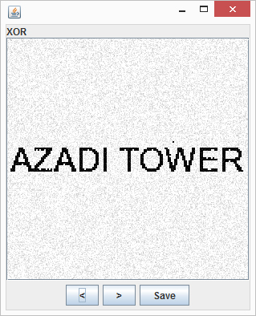
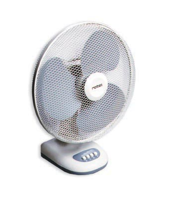
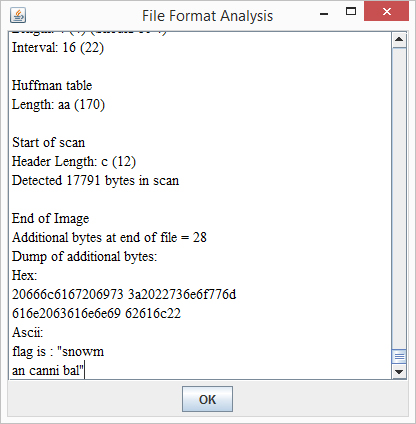
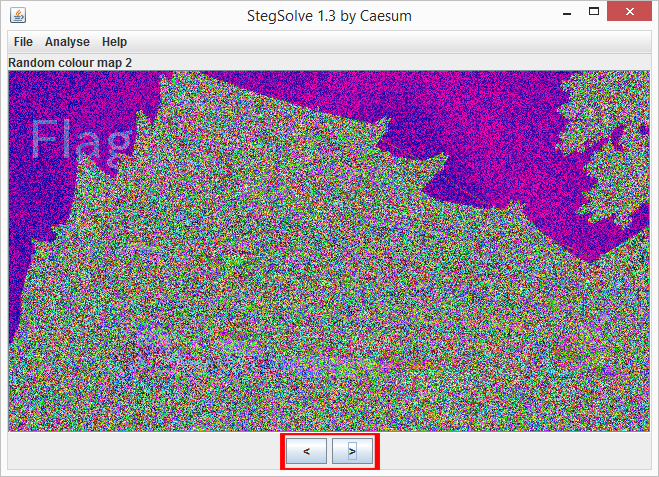
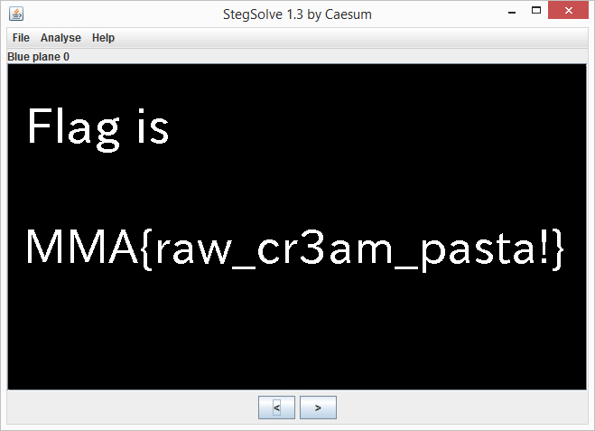
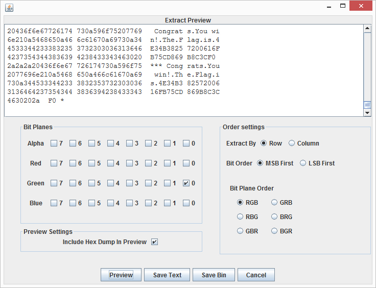

# Stegsolve
## Описание ##
Stegsolve - open source решение для анализа структуры файлов,изучения устройства стереограммы, а также самостоятельного рассмотрения каждой разрядной матрицы.
## Установка ###
* Для Unix систем  
wget http://www.caesum.com/handbook/Stegsolve.jar -O stegsolve.jar  
chmod +x stegsolve.jar  
mkdir bin  
mv stegsolve.jar bin/  

* Для Windows систем  
Скачиваем Stegsolve с
http://www.caesum.com/handbook/Stegsolve.jar  
Для его работы также необходимо установить Java Runtime Environment  
http://goo.gl/LKvNof

## Примеры использования ##
### XOR ###
1. Даны два изображения  
   

2. Открываем первое изображение, идем в Меню -> Analyse -> Image Combiner и выбираем второе изображение.  
3. В режиме XOR видим флаг AZADI TOWER  
.

### Анализ данных ###
1. Дано изображение  

2. Воспользуемся инструментом File format, находящимся во в кладке меню Analyse  
3. После того как сама картинка в файле кончается, за ней следует текст с флагом  
.

### Каналы изображения ###
1. Дано изображение  

2. При переключении каналов замечаем, что на одном из режимов присутствует часть слова "Flag"  

3. Проверяя оставшиеся каналы, находим режим, при котором возможно прочитать запись целиком  

### Извлечение данных ###
1. Дано изображение  

2. Производим анализ каналов изображения. Замечаем, что в режимах Red/Blue/Green Plane 0 исходное изображение полностью отсутствует  

3. Меню -> Analyse -> Data Extract  
Выбрав любой из приведенных выше режимов, нажимаем Preview. В окне Extract Preview видим флаг  

