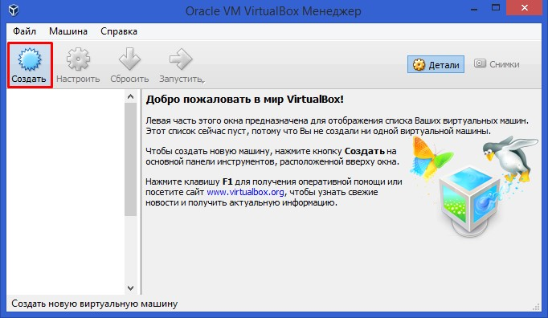
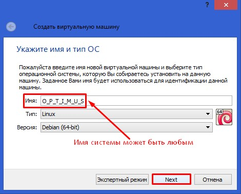
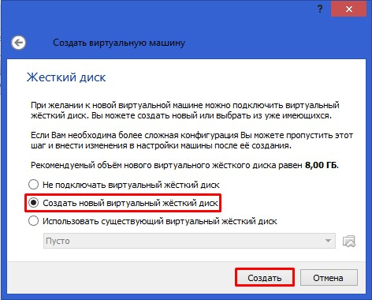
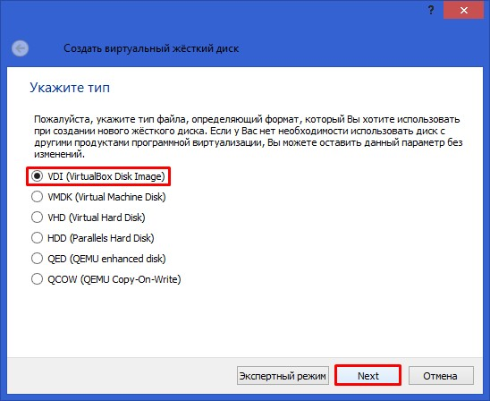
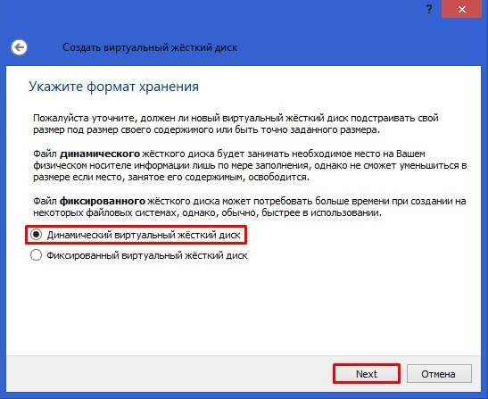
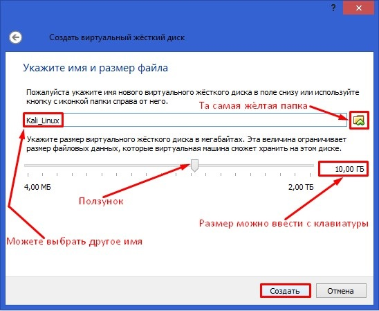

# Создание виртуальной машины

Виртуальная машина и виртуальная система – это не одно и то же. Мы добавляем виртуальную машину и интегрируем в неё операционную систему. Эта система называется виртуальной операционной системой.

Прежде всего необходимо скачать образ той операционной системы, которую мы хотим установить на VirtualBox. Я рассмотрю пример установки Kali Linux 1.0.8.

Чтобы добавить новую виртуальную машину, нажимаем кнопку «Создать».  

Теперь необходимо ввести имя виртуальной машины и выбрать тип операционной системы, а так же ее версию. Дистрибутив Kali Linux основан на Debian, поэтому я выбрал именно его.

Когда выбор сделан, нажимаем «Next».  

В следующем окне выбираем количество оперативной памяти для виртуальной машины (вы не можете выбрать больше, чем установлено на физическом компьютере). Рекомендуется выбирать половину оперативной памяти.

Когда выбор сделан, нажимаем «Next».  

В следующем окне вам предлагается выбрать виртуальный жёсткий диск, либо создать новый – так как мы запускаем программу впервые, создадим новый жёсткий диск, выбрав пункт «Создать новый виртуальный жёсткий диск».

Когда выбор сделан, нажимаем «Создать».  

В новом окне выбираем тип VDI и нажимаем «Next».  

На следующем этапе нужно будет указать формат виртуального жёсткого диска.

Если отметить «Динамический виртуальный жёсткий диск», то пространство на вашем жестком диске, выделенное под нужды виртуальной машины, займётся не сразу, а по мере накопления файлов в вашей виртуальной машине.

Выбираем именно этот вариант и нажимаем «Next».  

Указываем размер виртуального жёсткого диска.  

Вы также можете создать виртуальный диск на отличном от системного диске, это очень просто, нажмите на жёлтую папочку и откроется проводник, в нём укажите для размещения виртуального жёсткого диска любой раздел на вашем винчестере.

Когда выбор сделан, нажимаем «Создать».  

