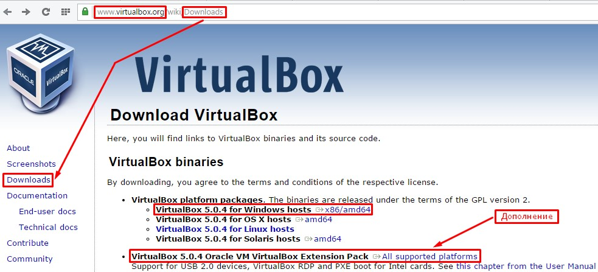
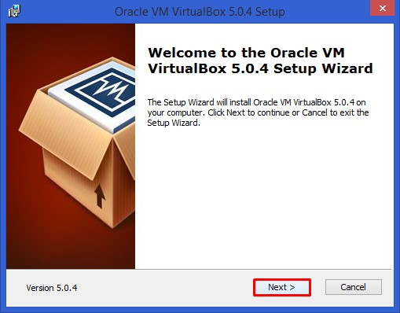
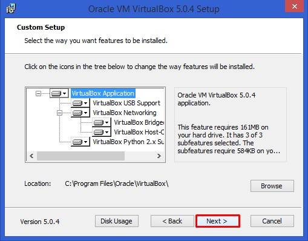
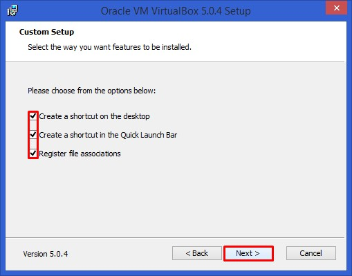
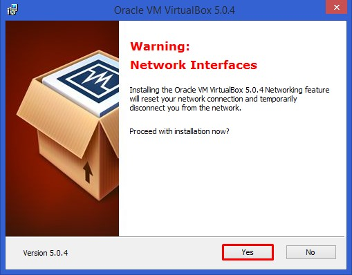
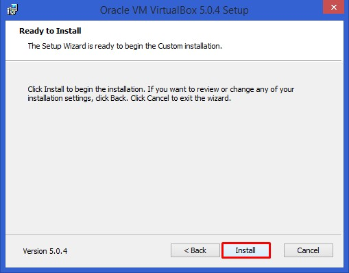
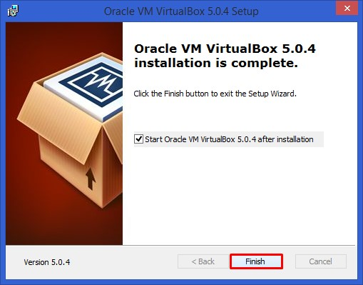
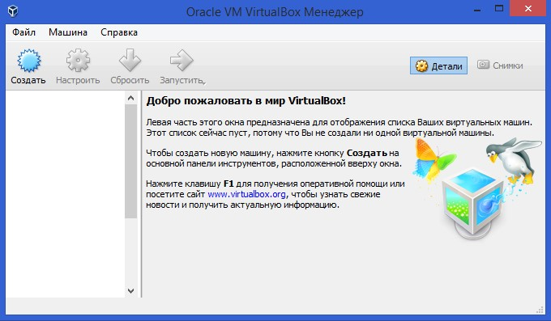

# Установка VirtualBox

Прежде всего нужно скачать установочный файл для VirtualBox.

Для корректной работы виртуальной машины рекомендовано скачать дополнение.

Для скачивания лучше всего : https://www.virtualbox.org/wiki/Downloads

Также подойдёт : http://rutracker.org/forum/viewtopic.php?t=4288778

Я скачивал установочный файл по первой ссылке.  

Запускаем скачанный инсталлятор для VirtualBox и нажимаем «Next».  

В следующем окне оставляем всё по умолчанию и нажимаем «Next».  

В окне выбора опций оставляем все галочки по умолчанию и нажимаем «Next».  

В следующем окне, установщик предупредит вас о том, что во время установки будет создано новое сетевое подключение что приведет к временному отключению вашего активного сетевого подключения.
Нажимаем «Yes».  

В следующем окне нажимаем «Install».  

Ждём некоторое время, пока программа устанавливается. После этого появится сообщение об успешном окончании установки. Нажимаем «Finish».  

Если всё прошло успешно, то перед вами откроется программа «VirtualBox Менеджер».  

Сам по себе «Менеджер» является всего лишь оболочкой, с помощью которой будет вестись работа между виртуальной машиной и физическим компьютером.
