# Установка Kali Linux
Если вы готовы, то нажимаем «Запустить».  
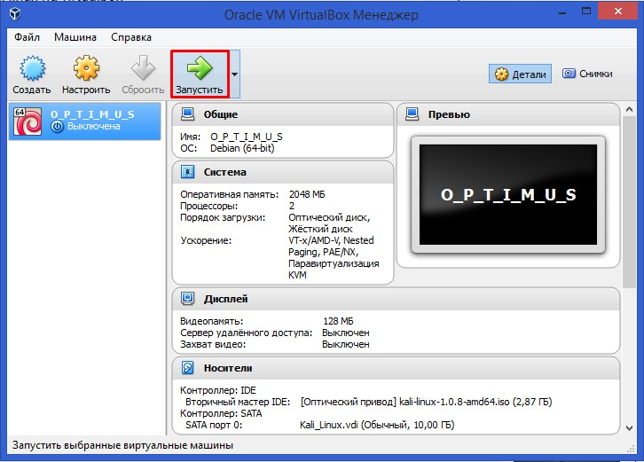

Выбираем «Install» и нажимаем «Enter».  

Чтобы переходить к следующему окну, следует нажать «Enter».  
Выбираем язык, который будет использоваться при установке системы и в самой системе по умолчанию (рекомендуется выбирать «Russian» или «English»).  
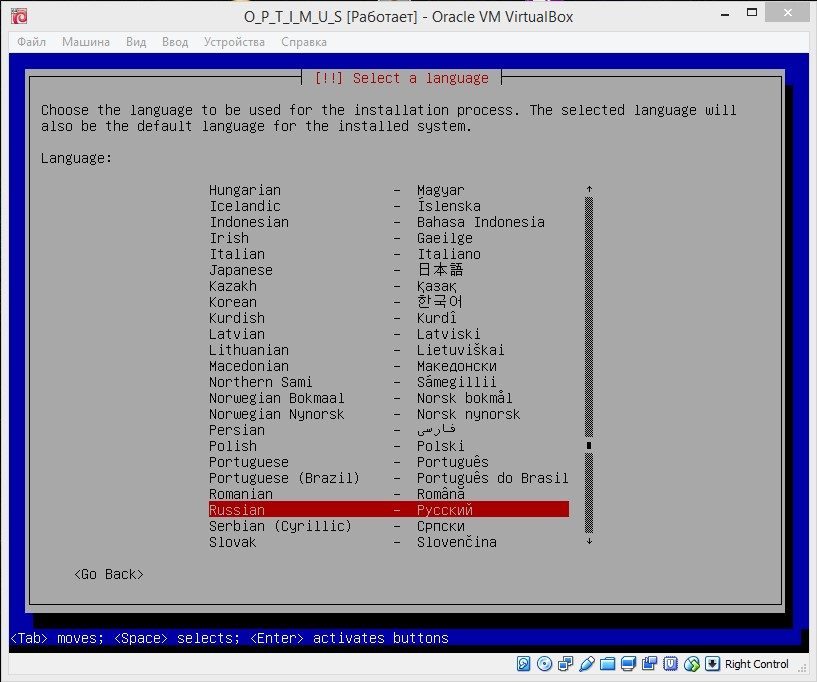

Укажите своё местоположение – это нужно для определения часового пояса.  
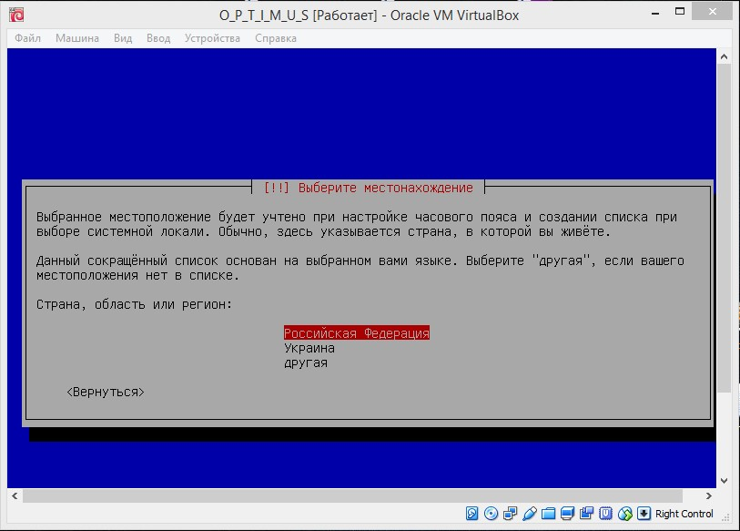

Выбираем раскладку клавиатуры.  
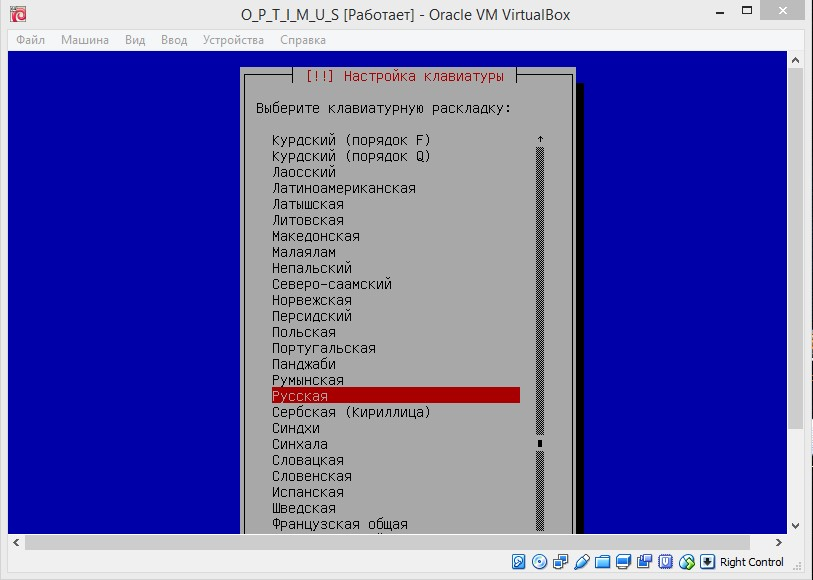

Выбираем способ переключения раскладки (как вам удобно).  
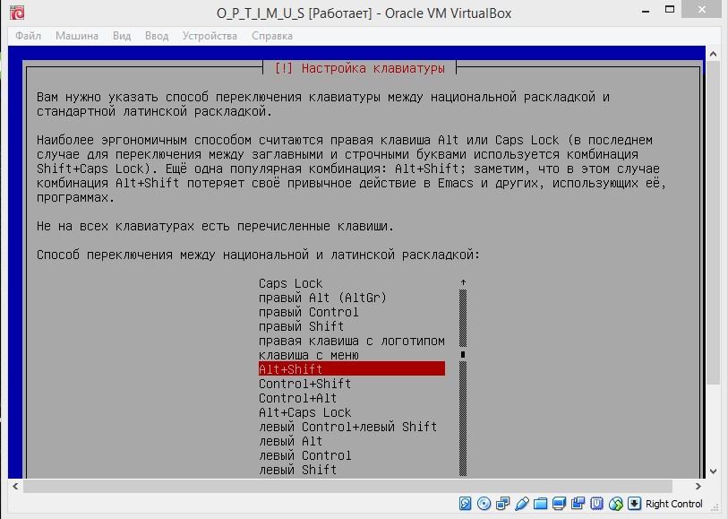

Выбираем имя для виртуальной системы (включите фантазию).  
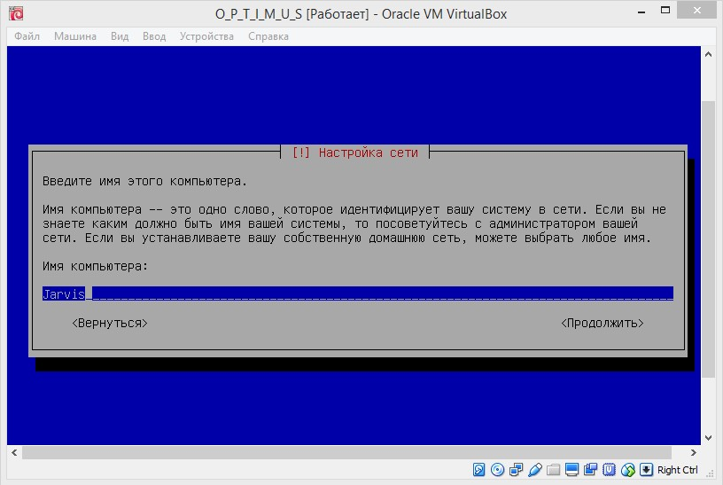

Если вы непрофессиональный пользователь, то просто пропустите этот пункт.  
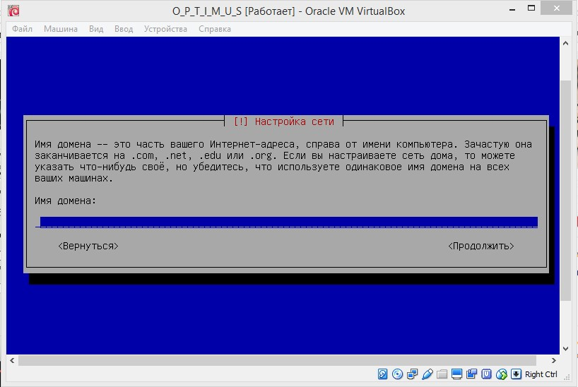

Введите пароль для своей учётной записи.  
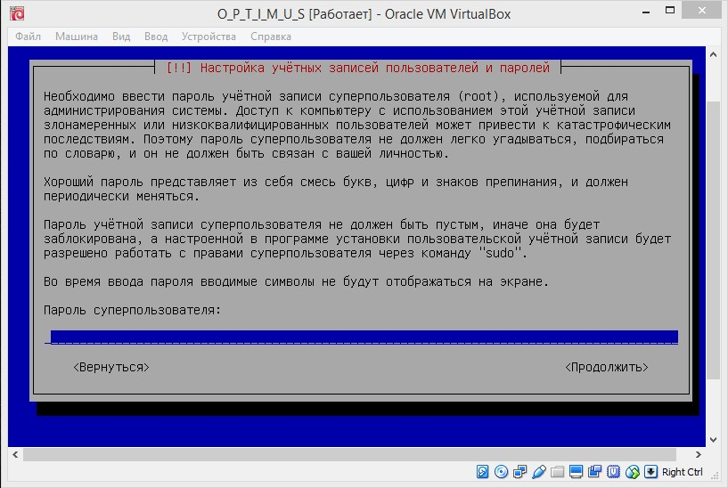

Подтвердите пароль.  
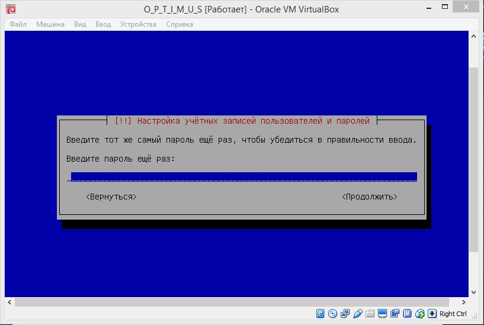

Выберите подходящий вам часовой пояс.  
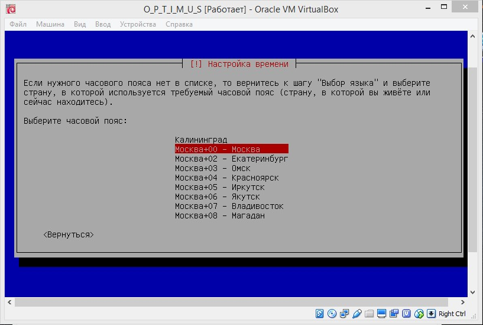

Выбираем «Авто – использовать весь диск».  
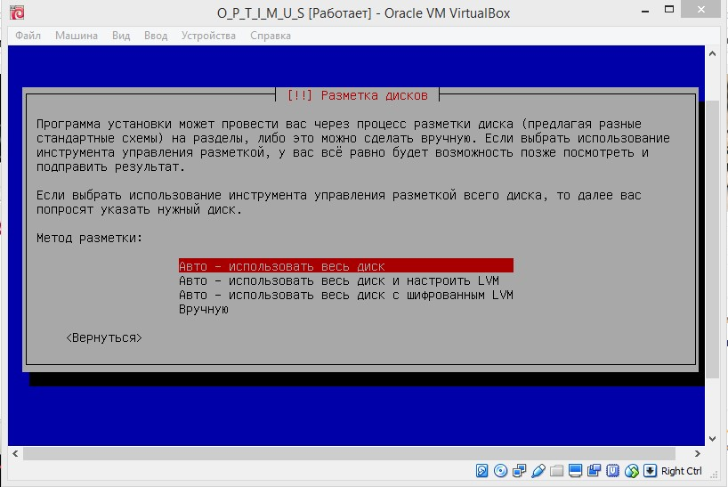

Тут все один пункт – выбираем его.  
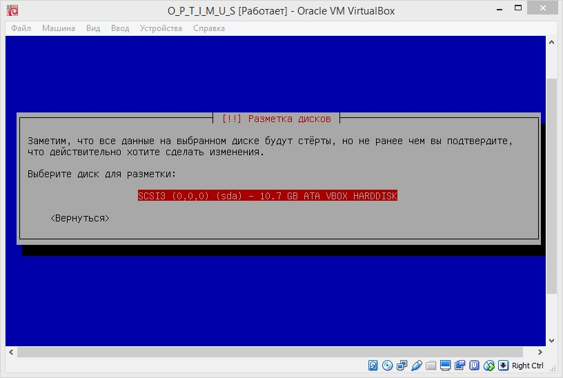

Если вы непрофессионал, то выбираем «Все файлы в одном разделе».  
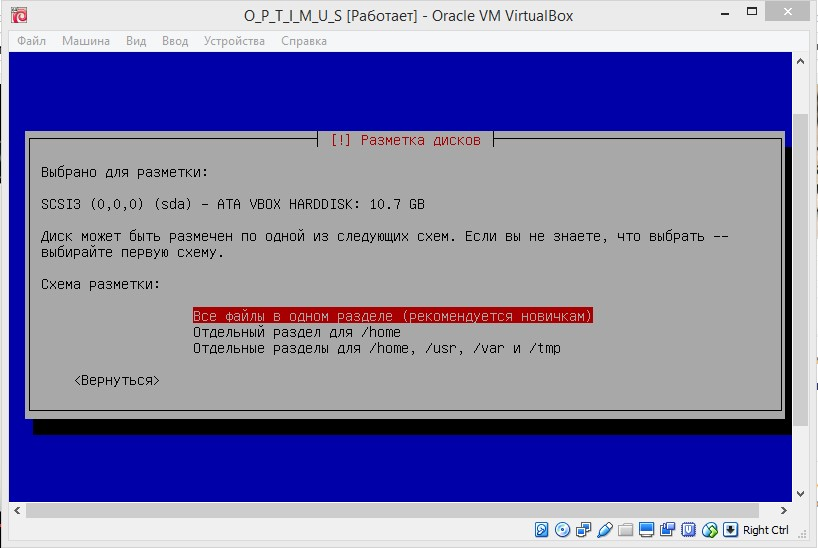

Выбираем «Закончить разметку и записать изменения на диск».  
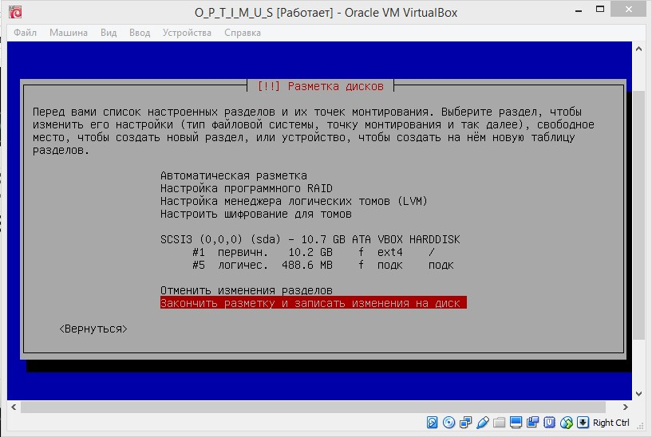

Выбираем «Да».  
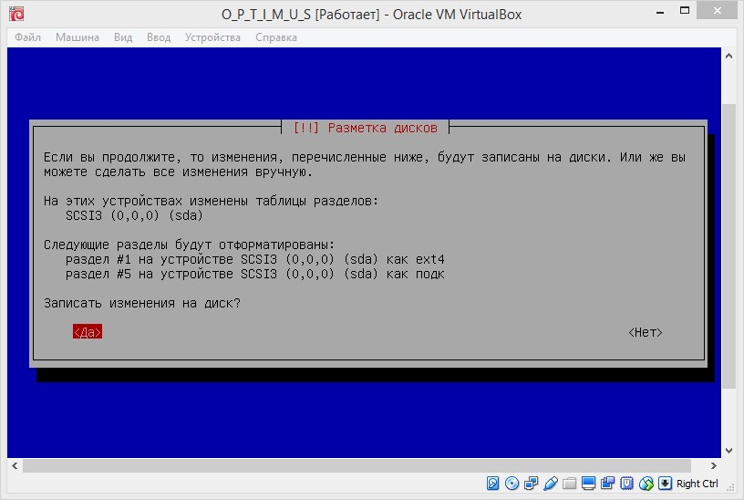

Выбираем «Да».  
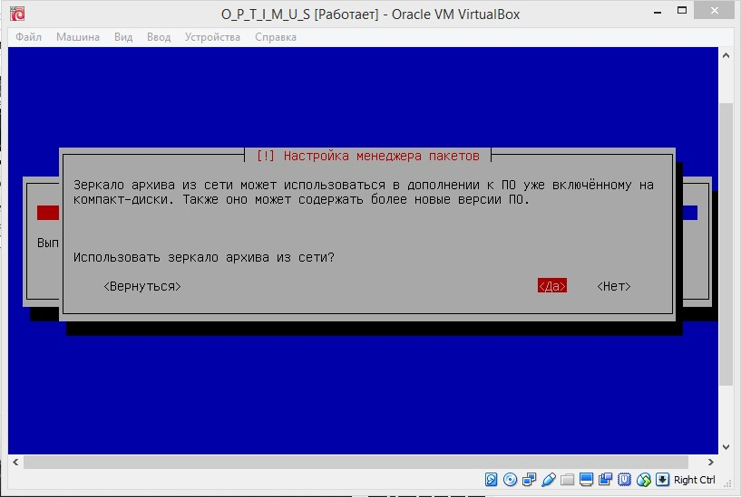

Если вы непрофессионал, то ничего не вводим и выбираем «Продолжить».  
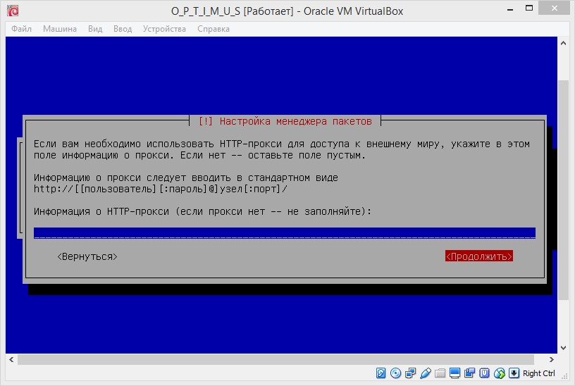

Выбираем «Да».  
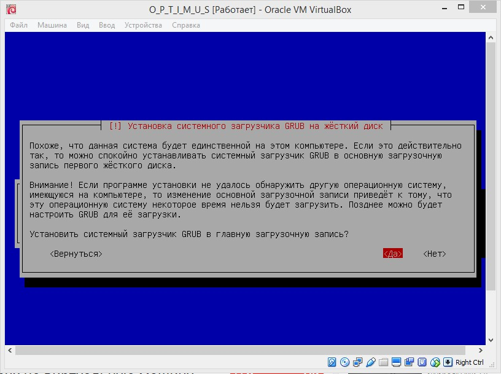

Выбираем «Продолжить».  
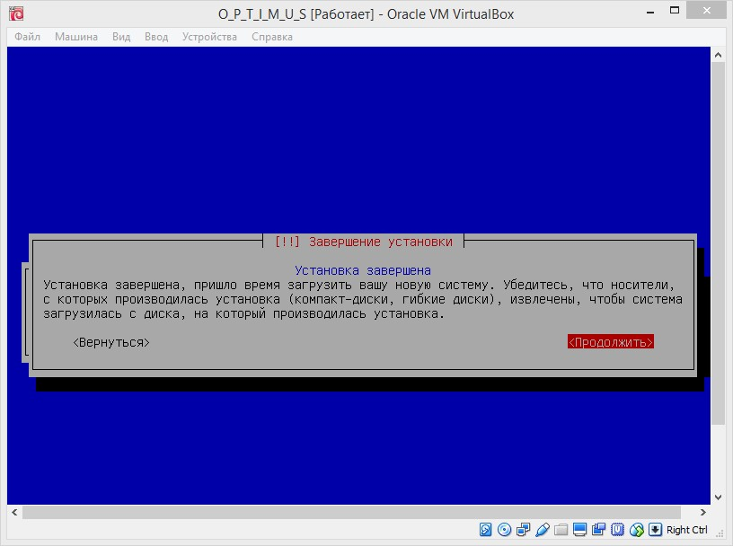

Вводим «root».  
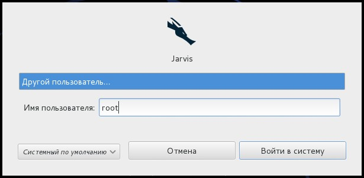

Вводим пароль.  
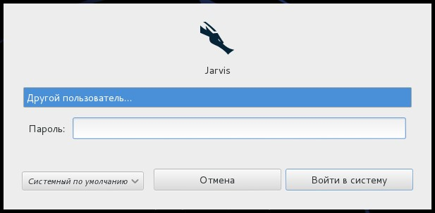

Аллилуйя, мы в системе.  

Переходи к вкладке «Вид» и выбираем «Режим полного экрана».  
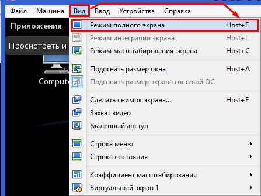

Если вам хочется сделать так, чтобы виртуальная система открывалась на весь экран, то идём дальше (я тоже устал, но осталось чуть-чуть). Переходим к вкладке «Устройства» и выбираем: «Подключить образ диска Дополнений гостевой ОС».  
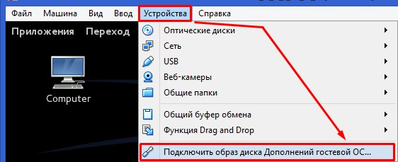

Выбираем «Запустить».  
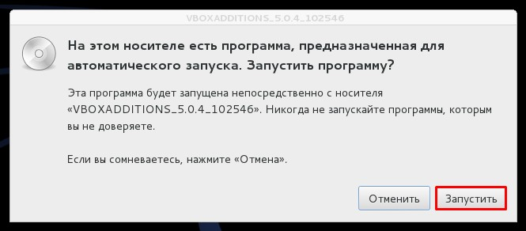

После окончания установки, перезагружаем виртуалку. Готово, вы молодцы, можете скушать печеньку. Хотя может случиться так, что ничего не получится. Не расстраивайтесь, вы не тупые (у меня тоже не получилось). Теперь нужно выполнить дополнительные действия.  
Видео:  
<iframe width="640" height="480" src="https://www.youtube.com/embed/Rka5MqnCn1E" frameborder="0" allowfullscreen></iframe>

Рекомендую просмотреть его до конца. Ближе к концу автор этого видео покажет, как можно сделать так, чтобы было на весь экран. Если не хотите тратить время, то установите ползунок на 12 минут 30 секунд.  
__Удачи. Если у вам не получится с первого раза, пробуйте еще. И да прибудет с вами google.__
