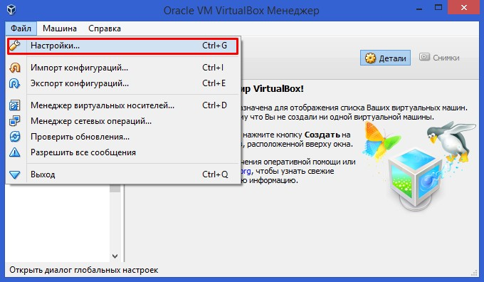
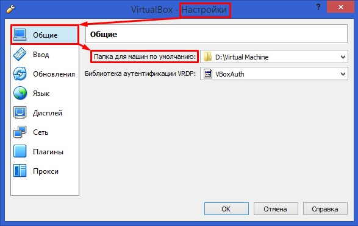
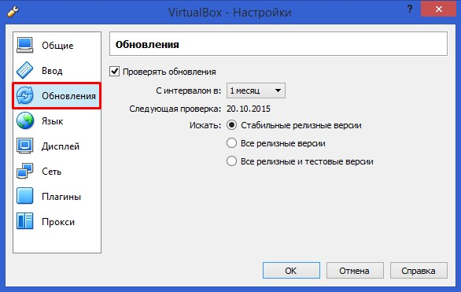
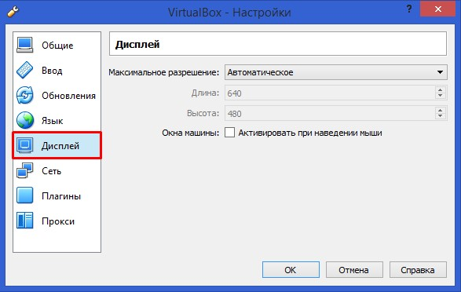

# Настройка VirtualBox

Прежде всего необходимо указать папку, в которую по умолчанию будут устанавливаться виртуальные машины:
> «Файл» > «Настройки» > «Общие» > «Папка для машин …»

Далее следует перейти к вкладке «Обновления» и задать настройки по своему желанию, однако рекомендуется ставить стандартные настройки.  

Далее следует перейти к вкладке «Дисплей» и задать параметры экрана.  

Далее следует перейти к вкладке «Плагины». Если плагин у вас уже установлен, то пропустите этот шаг. Если плагин не установлен, то необходимо указать путь к скачанному плагину.  

Если вы в процессе работы на виртуальной машине собираетесь использовать прокси-сервер, то вам также следует перейти к вкладке «Прокси» и, поставив галочку, ввести адрес прокси-сервера. Настройки VirtualBox можно изменять перед каждым запуском виртуальной операционной системы.  
Когда, вы закончите настройку, нажмите кнопку «ОК».
