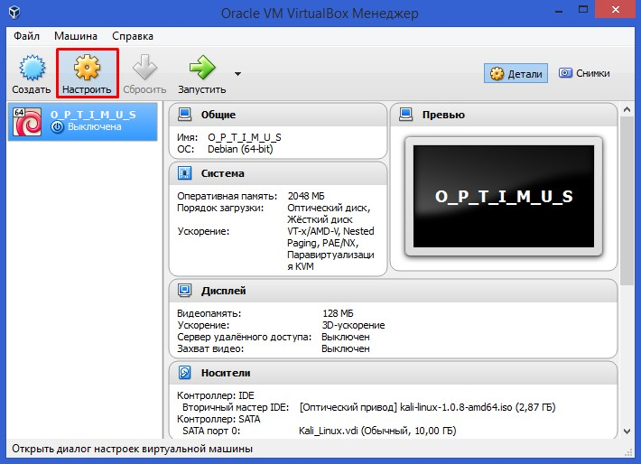
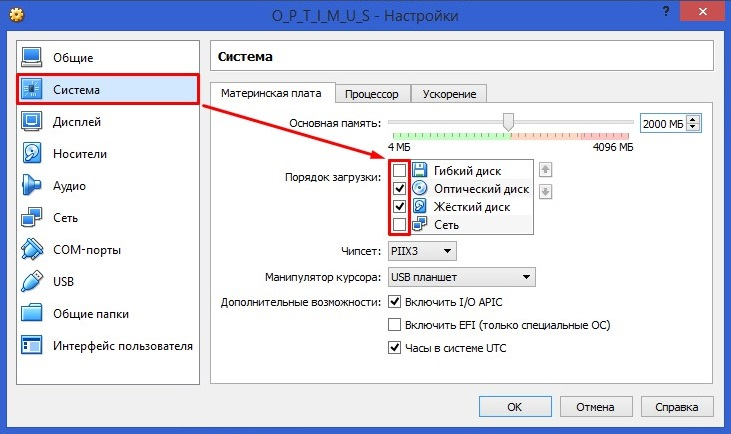
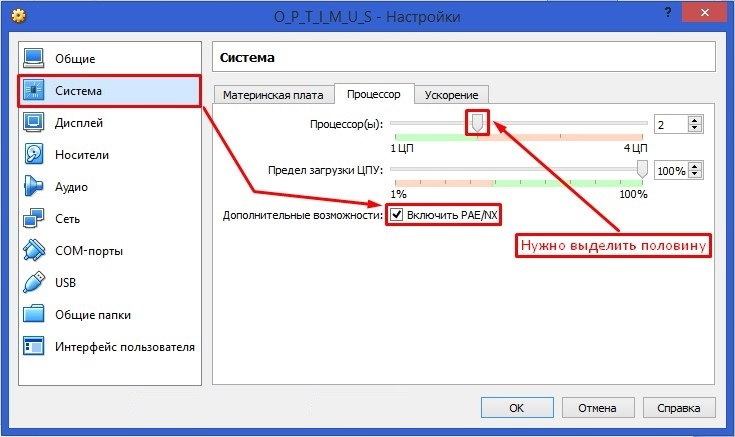
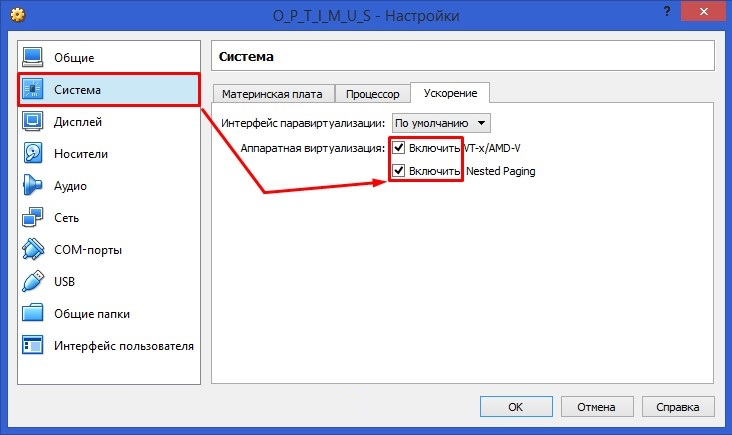
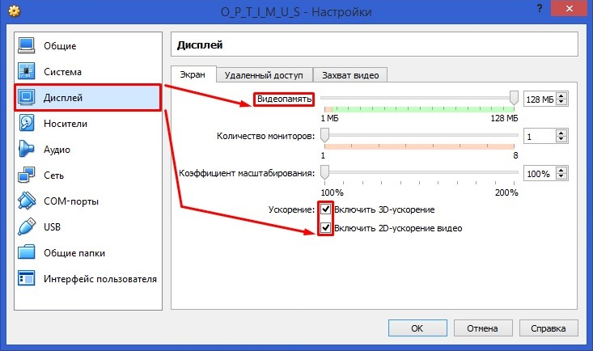
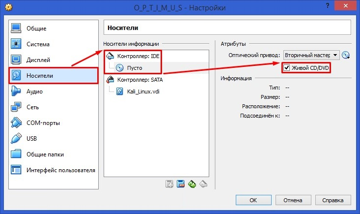
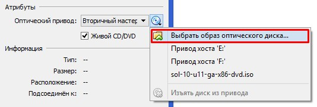
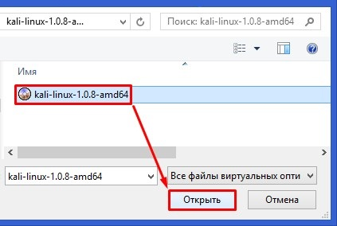
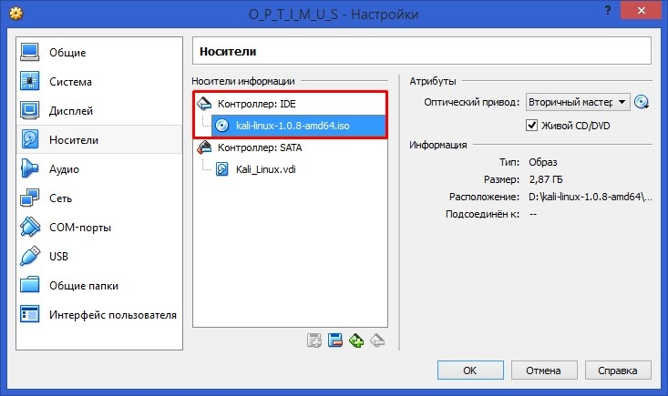
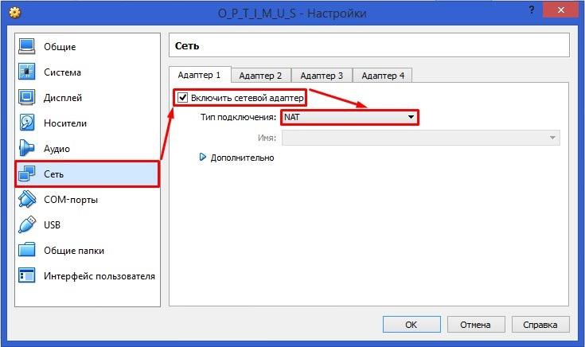

# Настройка виртуальной машины

Итак, виртуальную машину мы создали, теперь её нужно настроить и установить в неё наконец скачанный нами образ операционной системы.
Выделяем нашу виртуальную машину и жмём «Настроить».  

Далее переходим к вкладке «Система» > «Материнская плата».
Снимаем галочку с пункта «Дискета», оставляем первым загрузочным устройством «CD/DVD-ROM», а вторым устройством оставляем «Жёсткий диск» (так как виртуальную машину мы будем загружать с установочного диска или образа).  

Далее переходим к вкладке «Система» > «Процессор». Ставим галочку напротив пункта «Включить PAE/NX».  

Если вы считаете, что компьютер мощный, то перейдите к вкладке «Система» > «Ускорение».  
Ставим галочки напротив пунктов с надписью «Включить …».

Далее переходим к вкладке «Дисплей» > «Видео». Если максимум у видеопамяти равен 128 Мб, то ставим все 128 Мб (если 256 МБ или больше, то ставим половину от максимального значения).
Ставим галочки напротив пунктов с надписью «Включить …». Если компьютер не очень мощный, то можно обойтись и 2D-ускорением.  

Далее переходим к вкладке «Носители». В появившемся окне выбираем : «Носители: IDE» > «Пусто». Теперь ставим галочку рядом с надписью «Живой CD/DVD».  

Далее рядом с надписью «Живой CD/DVD» нажимаем на маленький диск. В появившемся окне нажимаем «Выбрать образ оптического диска».  

Открываем «Проводник», выбираем нужный образ и нажимаем «Открыть».  

В итоге образ «Kali Linux 1.0.8» присоединился к виртуальному дисководу.  

Далее переходим к вкладке «Сеть». Отмечаем галочкой «Включить сетевой адаптер». Выбираем тип подключения «Виртуальный адаптер хоста».  

