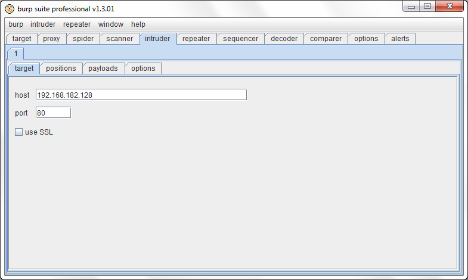
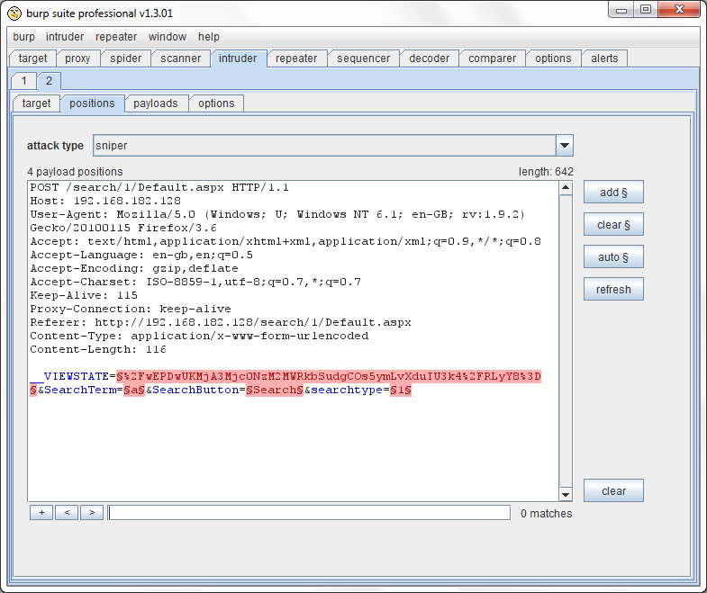
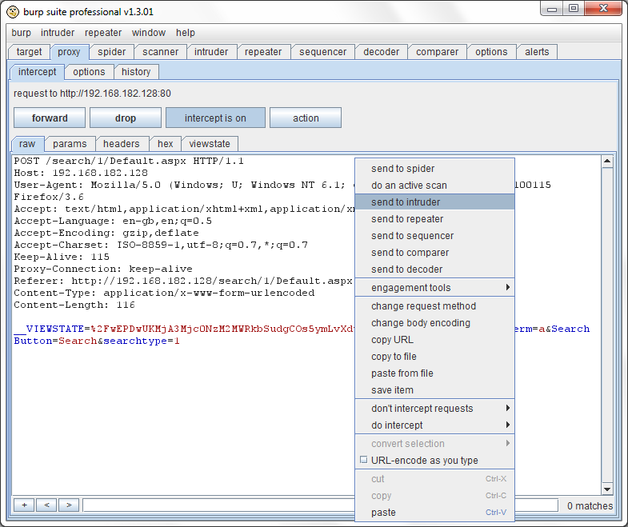
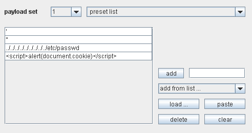

# Burp Suite
Что такое Burp Suite?

Burp Suite - это интегрированная платформа, предназначенная для проведения атак на веб-приложения. BS включает в себя разнообразные утилиты с специально спроектированными интерфейсами, позволяющими улучшить и ускорить процесс атаки. Все эти инструменты основываются на мощном фреймворке, который позволяет им перехватывать и показывать пользователю HTTP-сообщения, работать с аутентификацией, прокси-серверами и производить логирование различных данных.

Burp Suite позволяет отдельным утилитам взаимодействовать друг с другом, что в разы увеличивает эффективность работы. Например:

* Центральная карта сайта используется для общего сбора информации о целевых приложениях и установки общей площади работы BS, что распространяется на все утилиты без исключения.
* Любой HTTP-запрос и ответ, обработанный любой утилитой может быть передан на обработку в другой инструмент BS. Например, запрос из истории Burp Proxy может быть отправлен в Burp Intruder для создания основы автоматизированных атак. Или же он может быть передан в Burp Repeater, для ручного проведения атаки. В Burp Scanner для анализа на присутствие уязвимостей, или же в Burp Spider для автоматизированного исследования.
* Структура приложения может быть исследована в пассивном режиме без автоматизированной отсылки запросов. Все запросы и ответы обработанные Burp Proxy подвергаются немедленному анализу. Из них извлекаются ссылки, формы и полученная информация заносится в общую карту сайта. Это позволяет вам проводить исследование приложения в ненавязчивом виде с полным контролем всех исходящих запросов.
* Запросы обрабатываемые Burp Proxy могут сразу же автоматически проверяться на наличие в них признаков существования уязвимостей в то время как вы будете не торопясь просматривать целевой сайт в браузере.
* Интерфейс IBurpExtender может быть использован для расширения функционала как всего Burp Suite в целом, так и отдельных его инструментов. С его помощью данные, предоставляемые одной утилитой, могут быть использованы для изменения поведения другой утилиты.

## Утилиты Burp Suite
Burp Suite включает в себя следующие утилиты:

* Proxy - Прокси сервер, перехватывающий сообщения проходящие по протоколу HTTP(S) в режиме man-in-the-middle. Находясь между браузером и целевым веб-приложением он позволит вам перехватывать, изучать и изменять трафик идущий в обоих направлениях.
* Spider - Веб-паук, позволяющий вам в автоматическом режиме собирать информацию о содержимом и функционале приложения.
* Scanner [Только Pro-версия] - мощная утилита для автоматического раскрытия уязвимостей в веб-приложениях.
* Intruder - Максимально гибкая в настройках утилита, позволяющая в автоматическом режиме производить атаки различного вида. Например, перебор идентификаторов, сбор важной информации, фаззинг и прочее.
* Repeater - Инструмент для ручного изменения и повторной отсылки отдельных HTTP-запросов, а также для анализа ответов приложения.
* Sequencer - Утилита для анализа качества генерации случайных данных приложения (например идентификаторов сессий) на возможность предсказания их алгоритма.
* Decoder - Утилита для ручного или автоматического (де)кодирования данных приложения.
* Comparer - Инструмент для поиска визуальных различий между двумя вариациями данных.
* Extender - Инструмент для добавления расширений в BurpSuite (ОЧЕНЬ полезная штука)

Чтобы представить себе, каким образом между частями приложения циркулируют потоки данных, можно взглянуть на схему ниже  


## Burp Intruder
__Что такое Burp Intruder?__  
Burp Intruder - это утилита для автоматизированного проведения атак на веб-приложения.

Для того, чтоб эффективно его использовать вы должны понимать как функционирует целевое приложение и иметь базовые знания об устройстве протокола HTTP. Перед тем как запустить процесс атаки с помощью BI, вам необходимо как можно больше узнать о функционале и структуре исследуемого веб-приложения, изучить HTTP-сообщения которыми обмениваются браузер и сервер в процессе работы. Вы можете это сделать с использованием любимого браузера и Burp Proxy, для того, чтоб осуществлять перехват и просмотр запросов и ответов генерируемых приложением. Как только вы обнаружите какой-нибудь подозрительный HTTP-запрос, который следовало бы изучить на предмет наличия уязвимостей, вы можете задействовать Burp Intruder.

Burp Intruder обладает очень гибкой системой настроек, благодаря чему может быть использован для автоматизации множества видов атак. Вы можете использовать его и для выполнения иных задач, например, подбора пользовательских идентификаторов, сбора важной информации или фаззинга. Типы возможных атак зависят от особенностей конкретного приложения и могут включать: проверку на наличие SQL-инъекций, XSS, переполнение буфера, обход директории; bruteforce-атаки по различным схемам аутентификации, перебор значений, манипуляции с содержимым параметров; поиск скрытого содержимого и функционала, вычисление идентификаторов сессий и их перехвата, сбор данных, организация параллельных атак, реализация DoS-атак связанных с особенностями целевого приложения. Для более детального изучения возможных видов атак, которые могут быть реализованы с помощью Burp Intruder, смотрите главу 13 книги The Web Application Hacker's Handbook.

Burp Intruder содержит множество заранее подобранных списков с особо сформированными данными (строками, позволяющими обнаружить наличие уязвимостей). Кроме того, он содержит большое количество утилит для динамической генерации векторов атак, подходящих под конкретное приложение. Также в него могут быть загружены дополнительные списки, которые будут объединены с тем что есть на данный момент (например, списки с именами пользователей или выражения для фаззинг-атак ранее неизвестного вида).

Основу работы каждой атаки составляет отсылка определённого количества HTTP-запросов. Их содержимое генерируется на основе первоначального запроса, обнаруженного вами ранее. BI изменяет основной запрос несколькими способами, для того, чтоб попытаться обнаружить как можно большее количество уязвимостей. Это делается по средствам замены частей основного запроса различными опасными выражениями. Процесс выполнения и интервал проведения каждой атаки может быть настроен отдельно. Вы можете задействовать и механизм многопоточности. Кроме того, запросы могут формироваться таким образом, чтоб не попасть под внимание IDS. Режим отказа в обслуживании может использоваться для бомбардировки сервера запросами с игнорированием содержимого его ответов.

Во время выполнения атаки вам будет показана таблица с детальным описанием всего происходящего. В ней будут отображаться ответы сервера полученные на каждый запрос. Результаты будут содержать всю релевантную информацию с помощью которой можно будет с высокой точностью сказать о том, что данный запрос может быть интересен. В дополнение к стандартным результатам, являющимся общими для каждого вида атак, вы можете проводить множество гибко настраиваемых тестов в режиме реального времени в отношении получаемых результатов. Например, BI может быть настроен таким образом, чтоб извлекать определённую информацию из HTML-страниц (например, персональные данные на странице с профилем пользователя), и записывать её вместе с основным результатом. Все результаты могут быть экспортированы для дальнейшего изучения или использованы в качестве входных данных для работы других утилит Burp Suite.

BI является Java-приложением и может быть запущен только на платформах имеющих Java Runtime Environment. Для нормальной работы ему требуется версия 1.5 или старше. JRE можно взять на java.sun.com.

__Настройка Burp Intruder__  
Панель управления Burp Intruder позволяет настраивать одновременно одну или более атак в их вкладках. Вы можете создавать новые вкладки или переименовывать существующие с использованием меню Intruder.

Настройка каждой атаки состоит из работы с несколькими вкладками: (target, positions, payloads, options). Самый простой вариант создания новой атаки состоит в том, чтоб найти необходимый базовый запрос в результатах одной из Burp-утилит (например, в истории Burp Proxy или карты сайта) и в контекстном меню выбрать "send to intruder". Это действие приведёт к автоматическому заполнению вкладок "target" и "position". Вы можете использовать меню "Intruder" для контроля над тем как будут заполнятся вкладки "payloads" и "options" при создании новой атаки. Вы можете выбрать использование конфигурации атаки по умолчанию, скопировать конфигурацию с первой вкладки или с вкладки последней проведённой атаки. К примеру, вы можете создать стандартную конфигурацию атаки на самой первой вкладке (например, фаззинг найденных параметров и сбор сообщений об ошибках) и автоматически распространять её на каждую новую атаку посылаемую в Burp Intruder. Кроме того, вы можете копировать настройки между двумя любыми вкладками, или сохранять и загружать их используя меню Intruder.

Для того, чтоб начать проводить атаку вам необходимо указать её конфигурацию, после чего нажать "start attack" в меню Intruder. Описание каждой настраиваемой опции находится ниже.

Для загрузки ранее сохранённой атаки выберите "open saved attack" в Intruder-меню и укажите необходимый файл [Pro-версия].

__Вкладка Target__  
Она используется для указания данных целевого сервера:  


Поле "host" используется для указания IP-адреса или имени хоста целевого сервера. Поле "port" используется для установки номера порта HTTP(S)-сервиса. Галочка "use SSL" позволяет использовать для атаки Secure Sockets Layer-соединения.

__Вкладка Positions__  
Данная вкладка используется для создания шаблона для каждого HTTP-запроса генерируемого в ходе атаки:  


Основной текстовый редактор используется для указания содержимого базового запроса. Также в нём можно указать место, куда будут помещаться опасные данные. Кроме того, тут есть контекстное меню предоставляющее доступ ко всем основным функциям.

Простейшим путём создания шаблона для атаки является обнаружение интересующего вас запроса с помощью любой Burp-утилиты и клика по пункту "send to intruder" контекстного меню. Вы можете отправить запрос из любого места Burp Suite где есть отображение HTTP-запросов или ответов, а также из истории Burp Proxy, дерева карты сайта или её таблицы, и из уже проводящейся атаки BI:  


Позиции размещения опасных данных обозначаются парами символов §, которые ограждают текст находящийся между ними. Когда специально сформированные данные помещаются внутрь текущего запроса, они заменяют собой всё что находится между § (в т.ч. и эти символы). Если для текущего запроса не требуется вставка опасных данных (например, для атак типа "sniper", описанных ниже), то § просто удаляются без внесения каких-либо изменений.

Когда вы отдаёте BI запрос из любой Burp-утилиты, он автоматически обозначает самые лучшие позиции вхождения опасных данных. Это параметры находящиеся в теле запроса и в URL, а также cookies. Для большего удобства сами маркеры (§), и текст внутри них, специальным образом подсвечиваются. В Intruder-меню вы можете указывать как именно должны вести себя опасные данные при вставке в обозначенные места - заменять имеющееся значение или добавляться к нему. Чуть выше редактора запроса отображается количество имеющихся позиций и размер текущего шаблона.

Вы можете использовать кнопки на этой вкладке для контроля размещения позиций опасных данных:
```
add § - Добавить одиночный маркер § в место нахождения курсора.
clear § - Удалить все маркеры либо из всего шаблона, либо из выделенной его части, если таковая имеется.
auto § - При нажатии данной кнопки маркеры во всём шаблоне, или выделенной его части, расставляются автоматически. При этом все созданные до этого маркеры удаляются. Эта функция очень полезна в тех случаях, когда нужно обозначить все возможные позиции вхождения опасных данных для быстрой проверки на общие виды уязвимостей (например, такие как SQL-инъекции или XSS), в то время как их ручное указание больше подходит для более конкретных или сложных атак, когда уязвимое место уже обнаружено.
refresh - Обновить цветовую подсветку элементов в редакторе.
clear - Удалить все маркеры.
```
Обратите внимание на то, что механизм автоматического размещения маркеров умеет распознавать XML-данные. Некоторые приложения отсылают их в теле запроса, например, в таком виде:
```
POST /function HTTP/1.0
Content-Type: multipart/form-data; boundary=weidhwiderfhwiuehwiuehfwerrf
Content-Length: 202

--weidhwiderfhwiuehwiuehfwerrf
Content-Disposition: form-data; name="data"

<param1>foo</param1>
<param2>bar</param2>
<param3>123</param3>


--weidhwiderfhwiuehwiuehfwerrf
```
Если вы используете авто-размещение маркеров на сообщении целиком, то Intruder пометит весь XML-блок как одну цельную позицию вхождения опасных данных. Если же вы вручную выделите XML-блок, то функция авто-размещения отметит каждый XML-параметр отдельно.

Выпадающее меню "attack type" используется для установки ключевых аспектов поведения BI. Значение, находящееся в нём, определяет метод размещения опасных данных в обозначенных позициях каждого запроса. Четыре возможных вида атак описываются ниже:

__sniper__ - При этом виде атак используется отдельный набор опасных данных. BI начинает по очереди брать все обозначенные маркерами позиции в запросе и помещать отдельно в каждую специально сформированные данные. Остальные позиции не обрабатываются - их маркеры удаляются из тела запроса, а содержимое остаётся нетронутым. Данный тип атак полезен при индивидуальном тестировании полей на наличие общих уязвимостей (таких как XSS). Итоговое количество отправляемых запросов здесь может быть посчитано путём умножения количества позиций для опасных данных на количество вариантов этих данных в используемом наборе.

__battering ram__ - Здесь используется отдельный набор опасных данных. Перебирая записи в нём, BI помещает проверочный текст сразу во все позиции отмеченные маркерами. Это может пригодиться когда для осуществления атаки необходимо помещать одни и те же данные сразу во множество мест. Например, имя пользователя в Cookie и в тело запроса. Итоговое количество запросов равняется количеству записей в наборе проверочных данных.

__pitchfork__ - Этот вид атак использует несколько наборов проверочных данных. Таким образом для каждого отрезка обозначенного маркерами (максимум 8) устанавливаются свои специально сформированные строки. BI перебирает наборы тестовых строк одновременно и помещает данные из них в каждый обозначенный участок запроса. Например, при первом запросе первая строка из первого проверочного набора будет помещена на первое место обозначенное маркерами. А первая строка из второго набора поместится на вторую позицию. При формировании второго запроса на первое место будет помещена вторая строка из первого набора, а на второе - вторая строка из второго набора. И так далее. Такой вид атак может пригодиться в ситуациях, когда приложению нужно отсылать всё время разные, но каким-то образом взаимосвязанные данные. Например, если необходимо отправлять имя пользователя в одном поле и его ID в другом. Общее количество запросов, совершаемых при проведении атак такого рода, измеряется количеством строк в наименьшем используемом проверочном наборе.

__cluster bomb__ - Данный вид атак использует несколько проверочных наборов. Для каждого отрезка обозначенного маркерами (максимум 8) устанавливаются свои специально сформированные строки. При проведении атаки BI проверяет все возможные комбинации выражений из всех тестовых наборов. То есть если у вас есть 2 проверочных набора, то при первом запросе Intruder поместит на первую позицию первую строку из первого набора, на вторую первую строку из второго. При втором запросе на первом месте останется первая строка первого набора, а на вторую будет помещена вторая строка второго набора. Потом третья, и так далее. Данный вид атак может быть полезен в ситуациях, когда требуется помещать в запрос разные, никак не связанные между собой данные. Например, имя пользователя в один параметр и неизвестный пароль в другой. Общее количество запросов, генерируемых при реализации данной атаки, может быть большим, не забывайте об этом.

__Вкладка Payloads__  
Данная вкладка используется для настройки одного или более набора проверочных данных. Если вы работаете с атаками типа "pitchfork" или "cluster bomb" (смотрите вкладку Positions), то вам необходимо указать несколько наборов проверочных данных, по одному на каждую позицию обозначенную маркерами в теле запроса (максимум - 8). Для этого используйте выпадающие списки "payload set".

Для каждого проверочного набора вы можете указать вид проверочных данных (preset list, character blocks, brute forcer и т.д.), а также дополнительную его обработку, которой будут подвергаться все значения из набора. Большое количество таких видов уже встроено в Burp Intruder. Некоторые из них очень гибко настраиваемы и могут быть полезны при проведении широкого диапазона атак. Всё это подробно описывается ниже.

__Виды проверочных данных__

*__Preset list__*  
Это самый простой вид, представляющий из себя обыкновенный, заранее составленный список проверочных строк.  


Основные кнопки его настройки находятся внизу справа. Новые строки могут быть добавлены с помощью текстового поля и кнопки "add". Выпадающее меню "add from list" может быть использовано для добавления в имеющийся список наиболее популярных групп проверочных строк, включающих в себя распространённые имена пользователей и пароли, строки, сформированные специально для обнаружения таких уязвимостей как SQL-инъекции или XSS, и т.д. Кнопка "load" используется для импортирования строк из текстовых файлов. Кнопка "paste" добавляет в список строки из буфера обмена. "delete" стирает выбранные строки, а "clear" очищает список полностью.

Вы можете настраивать предустановленные списки проверочных данных, доступных в "add from list". Для этого выберите пункт "configure preset payload lists" в меню Intruder и укажите директорию, содержащую файлы с необходимыми строками. Кроме того, вы можете использовать кнопку "copy" для копирования всех встроенных списков Burp Suite в необходимую вам директорию для совместного использования с вашими списками.

*__Runtime file__*  
Этот вид позволяет указать внешний текстовый файл, который будет читаться в процессе работы BI. Он может пригодиться в ситуациях, когда список проверочных строк очень огромен и его невозможно (или нежелательно) целиком держать в памяти. BI будет постепенно считывать из указанного файла строки и использовать их в своей работе. Естественно, разделяться они должны символом переноса строки.

*__Custom iterator__*  
Данный вид является мощным генератором строк по задаваемым шаблонам. Например, приложение работающее с заработной платой сотрудников может идентифицировать служащих по персональным номерам в формате АВ/12. В таком случае вам может понадобиться перебрать все возможные персональные идентификаторы для получения интересующей вас информации.

Шаблон строки может иметь максимум 8 "позиций", которые используются для генерации частей итоговой строки. Для каждой позиции указывается список возможных значений и (опционально) разделитель, который вставляется между ней и следующей позицией. В примере приведённом ниже, позиции 1 и 2 будут содержать символы с A до Z, позиции 3 и 4 - цифры от 0 до 9. При этом позиция 2 будет иметь разделитель /. Как только начнётся проведение атаки, BI будет перебирать каждый символ в каждой позиции, пока не будут сгенерированы абсолютно все возможные варианты. В данном случае их количество будет равняться 26 * 26 * 10 * 10.

Выпадающее меню "scheme" может быть использовано для выбора заранее подготовленных шаблонов. Они могут быть использованы в чистом виде, либо модифицированы для проведения более сложных атак. Список готовых шаблонов включает в себя "directory / file . extension", который может использоваться для поиска скрытого веб-контента, а также "password + digit", позволяющий проводить простой подбор пароля.

Кнопки находящиеся снизу справа используются для настройки значения каждой позиции. Функции, выполняемые ими, похожи на функции элементов вида preset list. Кнопка "clear all" удаляет все настройки всех позиций.

*__Character substitution__*  
Этот вид атак берёт готовый список строк и генерирует новые, заменяя в оригиналах отдельные символы другими, следуя установленным пользователем правилам. Он может быть использован при атаках связанных с перебором паролей, когда требуется сгенерировать различные варианты слов из словаря.

Кнопки расположенные снизу справа используются для настройки списка заранее приготовленных строк. Их функции совпадают с функциями кнопок preset list.

Набор полей справа используется для создания правил замены. Как только начинается атака, BI перебирает их по очереди. Для каждой из строк-источников он генерирует несколько вариаций, в которой заменены символы из правил. Для примера, на основе первой строки, имеющейся на скриншоте выше, будет сгенерирован следующий список слов:
```
aahed
4ahed
a4hed
44hed
aah3d
4ah3d
a4h3d
44h3d
```
*__Case substitution__*  
Этот вид берёт заранее сформированный набор проверочных строк, и генерирует на их основе одну или более строк, изменяя регистр каждого символа. Данная функция может быть использована при атаках связанных с подбором паролей, для создания всех возможных вариантов (в плане регистра) слов из имеющегося словаря.

Кнопки расположенные снизу справа используются для создания списка исходных строк. Их функции аналогичны кнопкам из preset list.  
Галочки, расположенные справа, используются для настройки правил смены регистра. Имеют они следующие значения:  
* no change - при установке этого правила исходные строки меняться не будут.
* to lower case - все буквы в исходной строке будут приведены к нижнему регистру.
* to upper case - все буквы в исходной строке приводятся к верхнему регистру.
* to Propername - только первая буква в исходной строке будет в верхнем регистре.
* to ProperName - первая буква в исходной строке приводится к верхнему регистру, остальные буквы не меняются. Как только начинается выполнение атаки для каждой исходной строки, в соответствии с каждым установленным правилом генерируется новая строка. Если новоиспечённая строка является уникальной, то она добавляется в общий проверочный набор. Например, для первой строки, представленной на скриншоте выше, будут сгенерированы следующие варианты:
```
aahed
AAHED
Aahed
Recursive grep
```
Этот вид может работать вместе с функцией "extract grep" (описана ниже). Он позволяет генерировать проверочные строки на основе содержимого ответа на отправленный ранее запрос. Функция extract grep ищет в ответе сервера определённое содержимое по регулярному выражению. С "recursive grep" текст, извлечённый из прошлого ответа сервера, используется для генерации проверочной строки для следующего запроса.

Такая возможность может быть использована для атак связанных с перебором значений. Например, она пригодится при переборе содержимого БД через SQL-инъекцию, по средствам рекурсивной отправки запросов вида:  
```
union select name from sysobjects where name>'a'
```
Сообщение об ошибке раскроет имя первого объекта:
```
Syntax error converting the varchar value 'accounts' to a column of data type int.
```
Теперь запрос можно повторить, подставив в него "account" для идентификации следующего объекта. Эта задача может быть легко автоматизирована использованием "recursive grep".

Проверочная строка, используемая в первом запросе, может быть установлена вручную. BI можно настроить на остановку работы в том случае, если под ряд извлечено 2 одинаковых объекта. Обычно это означает успешное окончание перебора. В связи с этим вам следует помнить что атаки такого вида невозможно проводить в многопоточном режиме.
```
Illegal Unicode
```
Этот вид принимает заранее сформированный список строк, и обрабатывает их заменяя в исходных строках указанный символ каждым возможным неверным его Unicode-представлением. Данный вид может быть использован для попыток обхода фильтрации входящих данных, основанных на совпадении с конкретным выражением. Например, так чаще всего реализуется защита от атак обхода директории, когда на стороне сервера в принятой от пользователя информации ищутся фрагменты `../` и `..\`

Кнопки, расположенные снизу справа, используются для настройки списка исходных строк. Их функционал очень похож на preset list.

В двух небольших текстовых полях, расположенных в верхней части панели конфигурации, указывается символ для замены (по умолчанию \*) и символ, который будет взят за основу при формировании ошибочных вариантов (по умолчанию /). Символы можно указывать либо в чистом их виде (например, буквы), либо в HEX-представлении (например, 00) если они непечатные.

Настройки расположенные в центре, определяют тип неверного символа который будет сгенерирован. Они описаны ниже:

__maximum overlong UTF-8 length__ - В Юникоде разрешается описывать один символ максимум в 6 байтах. Основные ASCII-символы (0x00 - 0x7F) можно корректно отобразить с использованием и одного байта. Но можно попробовать представить 1 обычный символ используя более чем один байт (так называемое "переполнение" кодировки (на счёт точного перевода данной фразы не уверен, оригинал - '"overlong" encoding' - п.п.) ). Это выпадающее меню позволит вам указать максимальное количество используемых байт.

__illegal UTF-8 variants__ - Опция доступна если выбран максимальный размер символа 2 байта или более. Когда символ кодируется более чем одним байтом, байты следующие за ним должны иметь бинарную форму 10xxxxxx, для того, чтоб показать что они являются байтами-продолжениям. Как правило количество продолжающих байт указывается в составе первого байта, из-за чего при работе с Юникодом можно без опаски игнорировать первые 2 бита байтов-продолжений. Это означает что можно использовать 3 варианта неправильного обозначения байтов-продолжений, с бинарными формами 00xxxxxx, 01xxxxxx и 11xxxxxx. Если данная опция выбрана, то на каждый указанный символ будет генерироваться 3 его неверные многобайтовые формы. max permutations - Опция доступна если выбран максимальный размер символа 3 байта или более и активна опция "illegal UTF-8 variants". Если "max permutations" не активна, то неверные Unicode-данные будут помещаться в каждый продолжающий байт в отдельности. При этом остальные продолжающие байты будут оставаться неизменными. Если же вы активируйте данную опцию, то BI будет помещать неверные данные сразу во все продолжающие байты символа. Данная возможность может быть использована для обхода фильтраций основанных на поиске конкретных опасных выражений.

__illegal hex__ - Эта опция доступна всегда. Когда список ошибочно кодированных символов будет сгенерирован с использованием переполнения кодировки и ошибочного формирования продолжающих байтов (если выбрано), остаётся возможность модификации этих символов в шестнадцатеричном виде, для того, чтоб запутать средства фильтрации данных основанных на поиске конкретных выражений. В Hex-кодировании символы A-F используются для представления чисел идущих от 10 до 15. Как правило, некоторые программы при раскодировании hex-строк могут интерпритировать G как 16, H как 17 и т.д. Таким образом 0х1G может быть интерпритировано как десятичное 32. В дополнение к этому, если используются неверные HEX-символы на первой позиции двухзначных HEX-кодов, при расшифровке такого текста может произойти выход за размеры первого байта, что может заставить некоторые программы использовать младшие 8 байт итогового числа. Так 0x1G может быть раскодировано как десятичное число 257, которое в итоге будет воспринято как десятичное 1. Отсюда следует что каждый двухсимвольный HEX-код может иметь от 4 до 6 неверных HEX-представлений, которые будут раскодированы также как описано выше. Если вы включите опцию "illegal hex", то для всех вариантов неверно сформированных Unicode-выражений будут сгенерированы все возможные неверные HEX-представления (для каждого их ошибочного байта). max permutations - Данная опция активна только если максимальная выбранная длина символа равна 2 или более байтам, а также активирована опция "illegal hex". Когда данная опция не активна, при генерации HEX-представлений неверно сформированных Unicode-символов, работа идёт с каждым байтом по очереди. То есть генерируется от 4 до 6 возможных их ошибочных hex-представлений, но оставшиеся специально-сформированные байты (если они есть) не изменяются. Если же эта опция включена, то hex-варианты будут генерироваться сразу для всех нуждающихся байтов. Данная возможность может быть использована для обхода фильтраций основанных на поиске конкретных опасных выражений. add % prefix - Если эта опция выбрана, то символ % будет вставляться между каждыми двузначными hex-кодами в сгенерированных проверочных строках. lower case hex - Эта опция регулирует регистр алфавитных символов, используемых в hex-кодах. max encodings - Эта опция устанавливает максимальное количество специально-сформированных ошибочных вариаций байт, которые могут быть сгенерированы. Это может быть использовано в случаях, когда выбрано максимальное количество байт и/или активна опция "max permutations", так как они могут вызвать генерацию огромного числа неверно сформированных вариаций. Когда начинается проведение данного вида атак, BI перебирает каждую исходную строку из установленного набора, и в каждой из них заменяет все возможные вхождения особых символов на их ошибочные вариации.

*__Character blocks__*  
Этот вид используется для генерации строк заданного размера с использованием задаваемой начальной строки. Он может помочь вам при выявлении переполнений буфера и других уязвимостей, основанных на обработке данных неожиданной длины

В поле "string" должна быть указана исходная строка, из которой будут генерироваться итоговые строки. Поля "max" и "min" содержат начальный и конечный размеры итоговых строк. Поле "step" указывает на сколько должна увеличиваться длина итоговой строки при каждой следующей генерации.

*__Numbers__*  
Используется для генерации номеров, как случайных, так и последовательных.

В полях "from" и "to" должно быть указано минимальное и максимальное возможное число соответственно. Если выбрано "sequental", то номера начинают генерироваться с "from" и до "to", увеличиваясь каждый раз на значение из "step". Если выбрано "random", BI сгенерирует столько чисел, сколько указано в "how many". Числа могут генерироваться как в десятичной, так и в шестнадцатеричной форме. Если вы выбрали шестнадцатеричный формат, то поля "from", "to" и "step" обязательно должны содержать шестнадцатеричные значения.

С помощью полей расположенных правее вы можете настраивать формат итоговых чисел.

*__Dates__*  
Данный вид используется для генерации дат в указываемом диапазоне с заданным интервалом. Он может быть использован при переборе дат в приложении или сборе информации по ним (например, данные заказов за определённый день).

Даты начинают генерироваться с того, что указано в "from", постоянно увеличивая результат на содержимое "step". И так пока не доберутся до даты из "to". Несколько предустановленных форматов данных могут быть выбраны в выпадающем меню "format". Или же вы самостоятельно можете его указать. Следующие примеры иллюстрируют коды, которые могут быть использованы при указании форматов:
```
E	Sat
EEEE	Saturday
d	7
dd	07
M	6
MM	06
MMM	Jun
MMMM	June
yy	03
yyyy	2003
/ . : etc  	/ . :
Brute forcer
```
Этот вид генерирует набор проверочных строк заданной длины, содержащий все возможные комбинации символов выбранного набора.

*__Null payloads__*  
Используется для генерации "null"-строк, т.е. строк нулевой длины. Генерирует либо указанное количество пустых строк, либо максимальное из возможного.

Этот вид может быть использован когда для проведения атаки необходимо повторять одни и те же запросы без изменения их тел. Для этого маркеры в шаблоне (смотрите вкладку Positions) должны быть помещены рядом друг с другом. Эта функция может быть использована для многих видов атак. Например, когда вы перехватываете cookies для анализа каких-либо изменяющихся данных, или при осуществлении DoS-нападений, или для сохранения активности имеющегося идентификатора сессии, для последующего его использования в других тестах.

*__Char frobber__*  
Работает с данными находящимися внутри маркеров (одновременно со всеми, находящимися внутри запроса), либо с указанной строкой. В цикле изменяет один символ за раз, увеличивая его ASCII-код на единицу.

Данный вид может быть использован для тестирования значений (или их части) параметров, в ситуациях, когда они влияют на содержимое ответа приложения. Например, для определения того, какая часть из комплексного идентификатора сессии действительно является идентифицирующей. То есть если вы изменяете одни из символов идентификатора, но при этом видите что приложение до сих пор может вас опознать, значит этот символ не является частью идентифицирующей строки.

*__Bit flipper__*  
Данный вид работает с существующими значениями каждой, обозначенной маркерами позиции, или же с указанной вами строкой. Посимвольно обходя их он будет переворачивать каждый (или только указанный) бит.

Вы можете настроить этот вид на работу с обычной строкой или с ASCII-строкой в шестнадцатиричном представлении. Для примера, если за начальное значение взять "ab", то операция по переворачиванию каждого её бита даст следующие результаты:
```
`b
cb
eb
ib
qb
Ab
!b
áb
ac
a`
af
aj
ar
aB
a"
aâ
```
Если же представить ту же строку в шестнадцатеричном ASCII-представлении, то будут получены следующие результаты:
```
aa
a9
af
a3
bb
8b
eb
2b
```
Данный вид может быть использован в ситуациях, в которых используется char frobber, но где необходимо иметь полный контроль. Например, если идентификатор сессии содержит важные данные зашифрованные в режиме CBC, у вас будет возможность изменять части исходной информации изменяя биты в зашифрованной строке. В такой ситуации вы можете использовать этот функционал для обнаружения наличия эффекта от переворачивания отдельных бит и выявления соответствующей уязвимости.

*__Username generator__*  
Этот вид принимает человеческие имена в качестве исходных данных, и генерирует возможные варианты логинов используя несколько схем.

Для примера возьмём имя "peter weiner". Оно может быть превращено в 115 различных логинов:
```
peterweiner
peter.weiner
weinerpeter
weiner.peter
peter
weiner
peterw
peter.w
wpeter
w.peter
pweiner
p.weiner
weinerp
weiner.p
etc...
```
Такая возможность может вам пригодиться если вашей целью является аккаунт конкретного человека, имя или email которого вы не знаете.  
Правила обработки проверочных строк В дополнение к каждому набору проверочных строк, можно устанавливать различные правила их предварительной обработки. Такая обработка выполняется в самом конце всех манипуляций.

Установленные правила выполняются по очереди и могут включаться и отключаться, что облегчает проведение отладки при возникновении проблем с конфигурацией. Для использования вам доступны следующие виды правил:
```
add prefix
add suffix
match/replace
substring (с указанного символа по указанную длину)
reverse substring (как substring, только в обратном направлении - с конца к началу)
modify case (та же опция что и в case substitution)
encode (URL, HTML, Base64, ASCII hex и другие варианты кодирования свойственные отдельным платформам)
decode (as URL, HTML, Base64 и ASCII hex)
hash
add raw payload (может быть использован когда возникает необходимость помещения проверочных данных и в "сыром" и в хешированном виде)
```
Ну и наконец вы можете указать какие именно символы в проверочных данных будут заменены на их URL-представления для безопасной передачи по HTTP.  
Для финального URL-кодирования рекомендуется использовать именно эту настройку, а не вышеописанные правила например, потому что одновременно с этим опция payload grep может быть использована для поиска в ответах проверочных строк в чистом виде.

__Вкладка Options__  
Данная вкладка содержит различные опции позволяющие контролировать процесс проведения отдельных атак.

Эти опции используются для управления HTTP-заголовками в генерируемых запросах.

Если вы отметите поле "update Content-Length header", то Burp Intruder будет добавлять или изменять HTTP-заголовок "Content-Length" в каждом генерируемом запросе, в соответствии с длиной данных в их телах. Эта возможность является необходимой при проведении атак, основанных на помещении в тело запросов специально сформированных данных постоянно меняющейся длины. Спецификация HTTP, и большинство веб-серверов, требуют чтоб в данном заголовке использовалось корректное значение. Если же его нет, целевой сервер может вернуть ошибку, не до конца обработать запрос или же станет ожидать от клиента передачи неопределённо большого количества данных.

Если отмечено поле "set Connection: close", то Burp Intruder будет добавлять или изменять соответствующим образом заголовок "Connection" в каждом формируемом запросе. В некоторых случаях (когда сервер не возвращает верное значение в заголовках Content-Length или Transfer-Encoding), эта опция может позволить ускорить процесс проведения атак.

Внимание: В ранних версиях BI на этой вкладке находились опции, позволяющие добавлять в запросы заголовок "Cookie". Этой функции больше нет, но для этих же целей вы можете использовать расширение session handling support.

Опция "concurrent request threads" позволяет определять, будут ли запросы при проведении атаки отсылаться синхронно в одном потоке, либо же для работы будут использованы несколько потоков. Использование последнего варианта пригодится при проведении атак, в которых главным является временной фактор. Например, задержка между принятием запроса и выдачей ответа. Кроме того, данная возможность может быть использована при поиске уязвимостей, связанных с обработкой приложением множества запросов, полученных за короткий промежуток времени. Ну и конечно же многопоточность может быть задействована при выявлении уязвимостей, позволяющих осуществлять атаки класса "Отказ в обслуживании"

Следующие 2 опции определяют как много раз Burp будет повторять запрос при возникновении ошибки работы с сетью (отказ в соединении, таймаут) и сколько времени он будет ожидать между попытками.

Опция "throttle" позволяет установить временную задержку между отправкой запросов. Нефиксированная задержка может служить простым (хотя и мало эффективным) способом сокрытия каких-либо иных действий или же использоваться для периодического выполнения простейших запросов, направленных, например, на сохранение активности идентификатора сессии. Изменяемое время задержки может пригодиться, например, для определения времени жизни сессии.

Опция "start" позволяет определить, будет ли атака начата сразу после её запуска, или же это произойдёт через какое-то определённое время, или BI будет ожидать команду "resume" (Смотрите Results view). Эта функция может быть использована в случаях, когда необходимо запустить атаку в заранее известное время, или же сохранить её на будущее.

Настройки хранения определяют как в процессе атаки будет сохраняться содержимое отдельных запросов и ответов. Запись данного материала происходит во временную директорию. Эта функция позволяет вам полностью наблюдать за процессом атаки, повторять отдельные запросы если это необходимо и отправлять их в другие Burp-утилиты.

Если отмечено поле "make unmodified baseline request", то в дополнение к основной настройке атаки Burp будет отправлять запрос-шаблон с начальными значениями изменяемых параметров. Он будет показан в таблице результатов под номером 0.

Если вы включите "DoS mode", то атака будет брать текущий запрос и слать его серверу не дожидаясь ответа на предыдущий. Как только запрос будет полностью передан, BI сразу же закроет TCP-соединение. Данная функция может использоваться для обнаружения уязвимостей приводящих к отказу в обслуживании на уровне не приложения, что в свою очередь позволит выделить самые высоконагруженные задачи, выполняемые на сервере.

Опция "store full payloads" указывает Burp Intruder, что необходимо у каждого результата записывать специально-сформированные данные в полном объёме. Это "съест" дополнительный объём памяти, но позволит вам во время проведения атаки выполнять такие действия как модификацию правил раздела "grep" или изменять шаблон основного запроса.

Настройки из раздела "grep" используются на шаблонном поиске данных в ответах сервера. Здесь есть три типа проверок:

* match grep - Они используются для проверки каждого ответа сервера на наличие в нём определённой фразы или на совпадение с простым регулярным выражением, составленном в стиле Perl. Для каждого отдельного выражения будет создана колонка в результирующей таблице, содержащая информацию о том, где было найдено совпадение. Стандартный набор выражений имеет очень широкий диапазон использования: при атаках связанных с перебором пароля, для сканирования на выражения типа "password incorrect" или "login successful"; для поиска признаков SQL-инъекций - поиск выражений содержащих "ODBC", "error" и т.д.  
Если выражения используются для поиска совпадений, то они могут содержать символы новой строки.

* extract grep - Эта вкладка используется для проверки всех получаемых ответов сервера на совпадение с указанными выражениями, а также, если необходимо, для немедленного извлечения совпадений (от найденного выражения до указанного символа или по указанную длину). Для каждого отдельного выражения в результирующей таблице будет своя колонка, в которую будет помещён извлечённый с его помощью текст. Эта функция может быть использована для поиска страниц, содержащих чувствительную информацию, и автоматизированного её извлечения, если в этом возникнет необходимость. Например, если вы получили доступ к странице управления пользовательскими аккаунтами, которая отображает данные того или иного пользователя в зависимости от переданного в URL ID, то вы можете запустить атаку, которая будет перебирать возможные ID и извлекать из полученных страниц логин и пароль каждого пользователя.
Если совпадения с выражениями встречаются BI несколько раз под ряд, то записано будет каждое из них. Это бывает полезно в ситуациях, когда важные данные содержатся, например, в нескольких строках в HTML-таблице, но не имеют какого-то определённого признака для точечного их извлечения.

* payload grep - Используется для проверки каждого ответа сервера на наличие в нём строк со специально-сформированными данными. Это может помочь при поиске XSS, и других инъективных уязвимостей, при наличии которых принимаемые от пользователя данные отображаются в ответе приложения.
Если выбрана опция "match against pre-encoded payloads", то в ответах происходит поиск каждой тестовой строки в чистом виде, перед применением к ней доступных вариантов кодирования (смотрите Payload processing). Использование данной опции является хорошей практикой. Например, если вы проводите поиск XSS-уязвимостей с использованием строк содержащих типографические символы. Тогда они должны быть переведены в URL-представления перед отправкой на сервер, но если они появятся в ответе, то отобразятся там в изначальном, не URL-кодированном виде.

Настройки переадресации позволяют контролировать поведение BI в случаях встречи с ответами, содержащими соответствующие коды (т.е. статус-коды 3хх и заголовок Location, содержащий новый URL) в процессе проведения атаки. Если вы укажите Burp Intruder следовать редиректам, то при их встрече он проследует по указанному в заголовке URL (максимальное количество переходов под ряд - 10) и запишет результат только конечного адреса. В отдельной колонке, в таблице результатов, запросы с переадресацией будут особым образом отмечены. Вы также можете настроить BI на следование переадресациям только в области исследуемого сайта (т.е. по адресам с тем же протоколом, хостом и портом), внутри границ работы (Вкладка Target => Scope), или на полное их игнорирование.

Включение следования редиректам может пригодиться в том случае, когда приложение, принимая какие-нибудь данные, возвращает ответ с кодом 3хх, перебрасывая клиента на страницу с интересной информацией об обработке его запроса. Например, при фаззинге параметров приложения оно может совершать переадресацию клиента на страницу с описанием ошибки, содержащую данные о природе возникшего сбоя, что поможет определить наличие той или иной уязвимости.

Обратите внимание на то, что в некоторых ситуациях, при включенной опции следования редиректам, атаки можно проводить лишь в 1 поток. Например, когда приложение хранит в сессии пользователя информацию, которая должна быть отображена при его переадресации. В этом случае многопоточная работа приведёт к тому, что вы не сможете точно связать информацию на итоговой странице с запросом, который привёл к переадресации на неё. Также вам стоит помнить о том, что приложение, обнаружив опасные данные в передаваемых параметрах, может перебросить вас на страницу выхода, что сразу изменит ход атаки.

Если включена опция "process cookies in redirects", то любые cookies, передаваемые клиенту вместе с ответом с кодом 3хх, будут переданы целевой странице. Это может пригодиться в случаях, когда вы проводите подбор пароля, а скрипт авторизации перебрасывает вас на отдельную страницу с её результатами. Плюс к этому при каждой попытке сервер заводит для клиента новую сессию.

*__Запуск атаки__*  
При создании новой атаки используйте вкладки на панели управления для указания необходимой конфигурации, после чего жмите "start attack" в меню Intruder. Для загрузки сохранённой ранее атаки, выберите там же пункт "open saved attack", после чего укажите необходимый файл.

При начале новой атаки проводится несколько проверок, в зависимости от выбранной конфигурации. Например, проверяется верно ли указаны позиции проверочных строк, выбран ли проверочный набор, правильно ли указаны параметры в разделах timing и grep. В случае неудачи некоторых проверок выполнение атаки останавливается, но иногда Burp просто выводит соответствующее предупреждение.

Каждая атака отображается в отдельном окне. В нём вы можете посмотреть результаты, сгенерированные атакой, а также изменить текущую её конфигурацию в режиме реального времени. Кроме того, в окне будет содержаться несколько опций для контроля процесса атаки, сохранения результатов, ответов сервера.

Внимание: При изменении конфигурации атаки во время её проведения необходимо сначала поставить её на паузу, а уже после применять нужные изменения.

__Вкладка Results__  
Пример, приведённый ниже, показывает таблицу результатов атаки, производящей перебор содержимого на целевом веб-сайте:

Данная атака использует тип "sniper" (смотрите Вкладку Positions ) для осуществления запросов к нескольким, наиболее часто встречающимся, именам веб-директорий. Для этого вида атак в таблице результатов по умолчанию отображается номер каждого запроса, позиция тестовой строки (если их более чем одна), саму проверочную строку, код HTTP-ответа полученный от сервера, зафиксирована или нет ошибка или таймаут, и длина ответа сервера. В дополнительных колонках могут быть отображены таймеры "received response" и "finished response" ("начало передачи ответа" и "ответ передан" соответственно, всё в милисекундах - п.п.), а также полученные cookies. Различные опции, типа grep, добавляют в результат дополнительные колонки. Каждая колонка может быть скрыта или показана с помощью меню "view". Результаты могут быть отсортированы по содержимому любой колонки с помощью клика на соответствующем заголовке (для сортировки в обратном порядке - shift+клик). Кроме того, вы можете копировать содержимое колонок целиком с помощью ctrl+клик по нужному заголовку. [Pro-версия].

Ключевая часть эффективной интерпритации результатов атаки состоит в обнаружении интересных или успешных ответов сервера, и идентификации запросов которые к ним привели. Интересные ответы, чаще всего, могут быть разделены на следующие группы:
```
Различные статус-коды;
Разная длина ответа;
Присутствие или отсутствие определённого выражения;
Возникновение ошибки или таймаута; или время начала или окончания генерации ответа.
```
Например, при раскрытии контента на запрос существующего объекта сервер должен ответить кодом "200 OK" с ответом изменяющейся длины. Когда запрос отправляется к несуществующему объекту, сервер может ответить кодом "404 Not found" или же с "200 OK", но содержащем сообщение об ошибке фиксированной длины. В случае же с подбором пароля, неудачная попытка авторизации может привести к ответу с кодом "200 OK", и генерации страницы содержащей фразу "login failed". При успешной попытке сервер может ответить кодом "302 Object moved", или "200 OK" со словом "welcome" в теле ответа.

Burp Intruder предоставляет функционал для отсева страниц по вышеописанным признакам. Функция поиска текста (смотрите Вкладку Grep) поможет вам отмечать ответы содержащие заданные ключевые слова или извлекать интересную информацию из определённых частей страниц. В таблице результатов записи могут быть отсортированы кликом на заголовке колонки (shift-клик для обратного порядка). В примере ниже статус-код ответа сервера является главным определяющим признаком важности результатов, и вся таблица с ними отсортирована соответствующим образом.

Вы можете отмечать одну или несколько записей добавляя к ним комментарии или подсветку.

Вы можете подсвечивать отдельные записи используя выпадающее меню в левой колонке.

Установка комментариев отдельным записям происходит при двойном клике в соответствующей ячейке.

После того как вы прокомментируете интересующие вас вопросы, вы можете использовать сортировку и фильтры для того, чтоб быстро их найти в будущем.

Если в конфигурации атаки была активирована функция сохранения запросов и/или ответов, то вы можете использовать окно предпросмотра для их визуализации. Кроме того, по двойному клику на отдельной записи можно увидеть все детали запроса и ответа связанных с ней. В этих окнах вы можете наблюдать детальный анализ и отображение всех HTTP-сообщений. Кнопки "previous" и "next" могут быть использованы для перехода между результатами. Если записи в итоговой таблице отсортированы, то нажатие этих кнопок будет показывать вам записи в порядке сортировки.

Если в настройках атаки включено следование редиректам, все запросы связанные с этим будут также иметься в таблице.

Вы можете использовать кнопку "action" для отправки запроса или ответа другим утилитам Burp Suite. Также вы можете кликнуть правой кнопкой мыши на отдельной записи и в появившемся контекстном меню выбрать следующие опции.

Вы можете передать выбранный предмет другим утилитам, добавить несколько предметов в итоговую карту сайта, отметить их с помощью комментария или подсветки, или же обозначить как нуждающиеся в повторной отправке. Последняя опция может пригодиться вам в тех случаях, когда во время атаки возникали неполадки с сетью или другие проблемы, помешавшие нормальной работе BI. Кроме того, это может вам пригодиться если вы изменили начальный шаблон запроса и хотите основываясь на нём повторить отдельные запросы. Так, например, в случаях когда приложение разрушило ранее активную сессию, вы можете модифицировать шаблон внеся в него новый идентификатор, и повторить неудавшиеся ранее запросы.

В самом верху результирующей таблицы находится панель фильтров, с помощью которой вы можете скрывать или отображать отдельные результаты, основываясь на статус-коде, наличие в их теле определённых выражений и т.д..

Вы можете удалять отдельные записи из результатов выбрав одну или более из них, и нажав "delete" в контекстном меню.

*__Меню окна результатов__*  
Окно результатов содержит несколько меню с командами, позволяющими контролировать ход атаки, и сохранять её результаты, ответы сервера и пр. Все они описаны ниже.

__Меню Attack__  
Содержит команды для остановки, продолжения или повтора атаки.

Меню Save attack - Используется для сохранения копии текущей атаки, включая её результаты. Сохранённый файл может быть загружен для дальнейшего использования через панель управления BI. results table - Используется для сохранения таблицы результатов в виде текстового файла. При этом вы можете выбрать отдельные строки и колонки, или же всю таблицу сразу. Также можно указывать и разделитель полей. Эта возможность может быть использована для экспорта результатов в электронные таблицы для дальнейшего анализа, или сохранения отдельной колонки в текстовый файл (как, например, данные полученные из тел сообщений grep-функциями) для последующей передачи этих данных другим утилитам. server responses - Используется для сохранения полных ответов полученных от сервера на все произведённые запросы. Можно сохранить их как в отдельные файлы (имена пронумеровываются в соответствующем порядке), так и в один сплошной. attack configuration - Используется для сохранения конфигурации текущей атаки (без результатов). Загрузить её можно через панель управления Burp Intruder для проведения идентичных, или немного изменённых атак. Меню View Содержит команды для просмотра или сокрытия каждой доступной колонки в результирующей таблице (их количество зависит от конфигурации используемой атаки).

## Ссылка на полную документацию
> * https://web.archive.org/web/20140321231724/http://h4s-team.ru/bs/index/index.html
> * https://www.pentestgeek.com/web-applications/burp-suite-tutorial-1/
> * https://www.pentestgeek.com/web-applications/burp-suite-tutorial-web-application-penetration-testing-part-2/


----
взято с сайта http://itsecwiki.org/