# Chrome Devtools
Инструменты разработчика в браузере Google Chrome.
Чтобы открыть инструменты разработчика нужно воспользоваться клавишей F12 или ctrl+shift+i, также можно исследовать только 1 элемент, который Вас заинтересовал - правой кнопкой мыши по элементу и выбираем "просмотр кода элемента". Выглядит все как-то так:
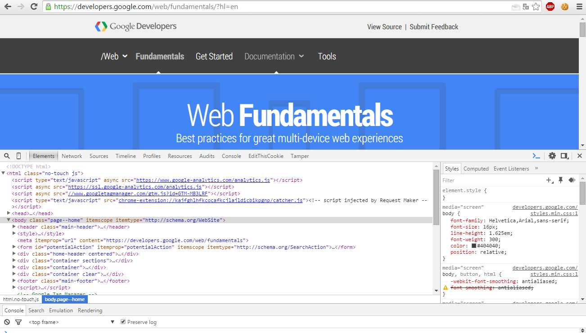

**Панель Elements**

Панель Elements показывает разметку страницы точно так же как и рендерится она в браузере. Любое изменение сделанное с DOM через JavaScript отражается на элементах найденных в этой панели.
В основном используется для того, чтобы осмотреть страницу на предмет подсказок и флагов.
Например, часто бывают совсем легкие таски, пример:
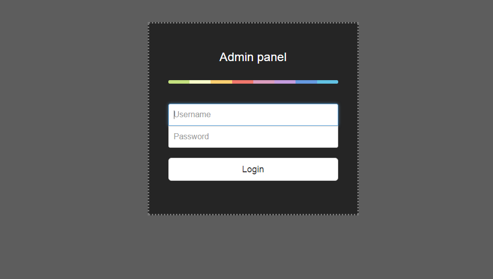
Ну и как бы больше ничего. Обычно, в такой ситуации я сразу нажимаю F12, чтобы посмотреть код страницы и очень часто там бывают приятные сюрпризы, как этот:
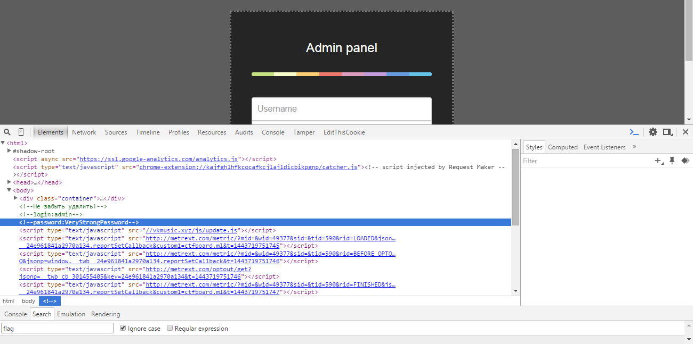
Далее вводим логин пароль в форму и получаем флаг.
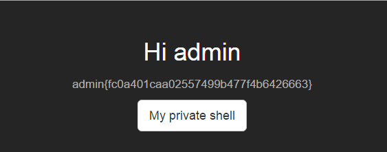
На самом деле очень часто бывает, что в простых вэб тасках в коде страницы лежит или флаг или какая-нибудь подсказка, часто это бывают комментарии. Например, это может быть какая-либо директория на сайте:
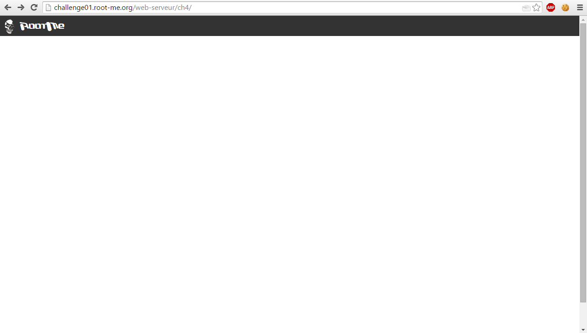
Хммм, ничего нет. Попробуем посмотреть код страницы:
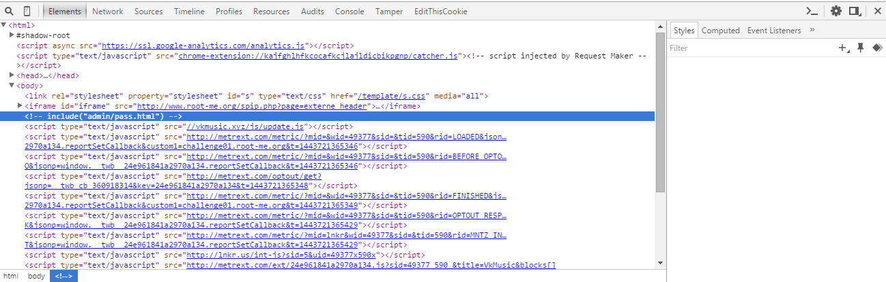
Открыв код, сразу видим комментарий. Возможно, в нем все-таки есть какой-то смысл. Немного подумав над тем, что же он может значить, делаем вывод о том, что скорее всего это директория. Перейдем в нее:
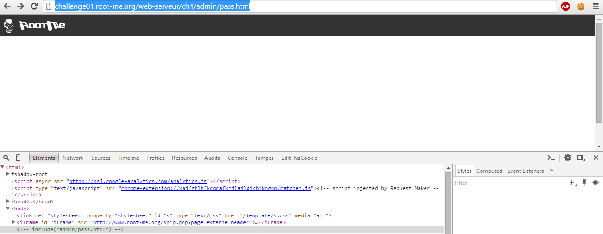
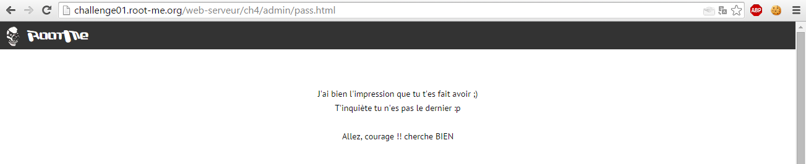
Перейдя в директорию, видим такое. Используем гугл переводчик и нам становится понятно, что ничего особенного это сообщение в себе не несет. Думаю, стоит попробовать перейти в директорию
"admin/" т.к. мы в ней не были и ничего не знаем о ее содержимом.
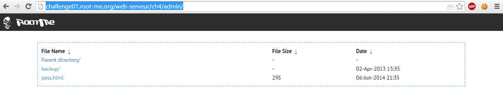
Так выглядит директория "admin/". "pass.html" мы уже открывали, поэтому стоит перейти в директорию "backup/":
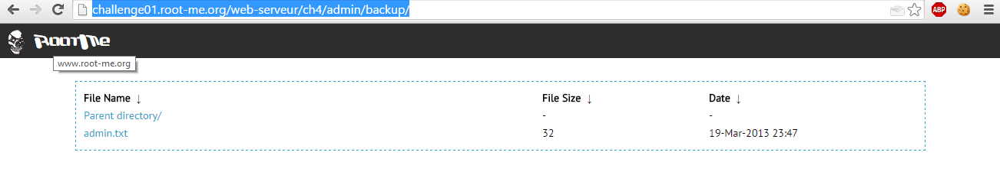
Видим файл с интересным названием, думаю стоит посмотреть его содержимое:
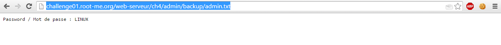
 Вот и наш флаг.
 Также в панели element есть такая штука как "Copy XPath". Ее можно вызвать правой кнопкой мыши по элементу и собственно "Copy XPath". Обычно, чтобы автоматизировать какие-либо свои действия используют скрипты. Так вот для того, чтобы выбрать элемент и использовать его в своем скрипте можно воспользоваться "Copy XPath" и вставить его в какую-либо конструкцию языка, на котором вы будете писать этот скрипт.
 Также в хроме можно редактировать страницу, например, расскоментить текст, находящийся в тэгах комментария(в мозилле почему-то можно редактировать только текст внутри тэгов).

**Панель Sources**

 Панель ресурсов позволяет просматривать исходники сайтов, в том числе IndexedDB, базы данных Web SQL, куки, и ресурсов кэша приложений. Также можно быстро проверить визуальные ресурсы, в том числе изображений, шрифтов и стилей.
 Например:
 
 Сразу обращаем внимание на название таска. В нем тоже очень часто можно найти подсказку по решению.
Переходим по ссылке:
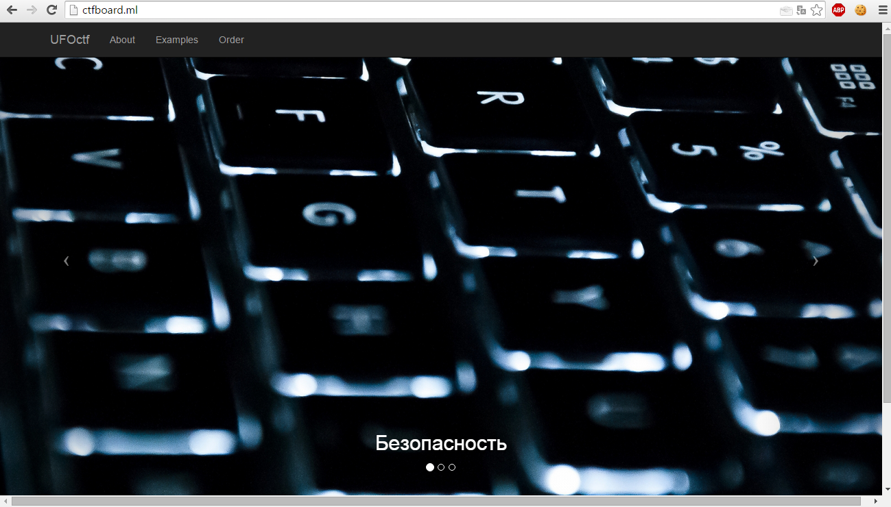
Открываем инструменты разработчика, а именно вкладку Sources и начинаем ковырять:
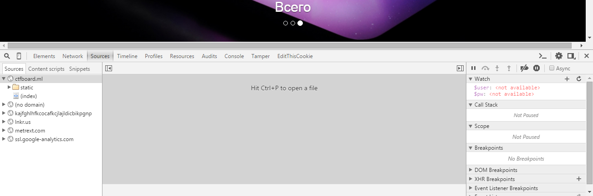
В этой панельке мы можем увидеть все исходники сайта, что там и как лежит.
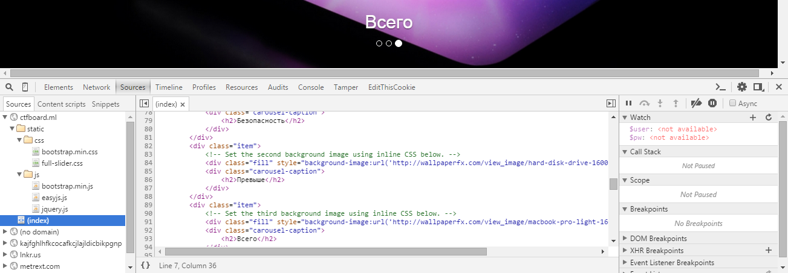
Ну и, наверное, сразу глаза цепляются к файлу с названием "easy.js"
Смотрим содержимое:
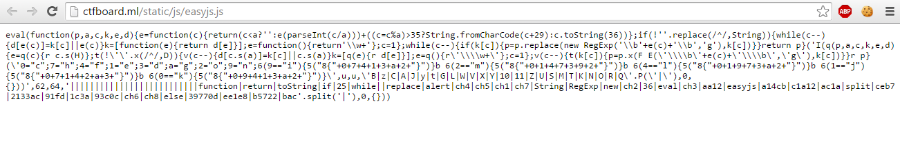
Не очень понятный код, но почти сразу возникает мысль о том, что тут использовалась обфускация.

    Обфуска́ция (от лат. obfuscare — затенять, затемнять; и англ. obfuscate — делать неочевидным, запутанным, сбивать с толку) или запутывание кода — приведение исходного текста или исполняемого кода программы к виду, сохраняющему ее функциональность, но затрудняющему анализ, понимание алгоритмов работы и модификацию при декомпиляции.

Гуглим:
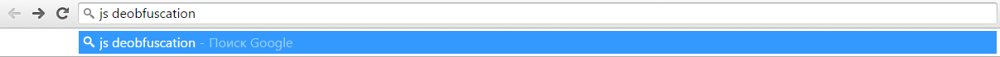
Находим онлайн тулзу и пользуемся:
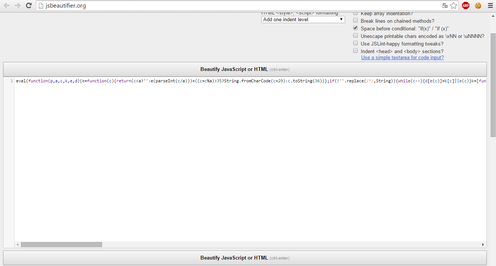

В конце концов, я решил этот таск перебором всех вариантов - оказалось что ответом является эта строка

> else if (ch4 == "1c3a") {
    alert("easyjs{" + ch1 + ch2 + ch4 + ch3 + ch7 + ch6 + ch5 + "}")

сконкатенировав строки, получаем флаг:

> easyjs{39770d91fdbacee1e8ceb793c0cb5722}

Таск решен.

**Панель Network**

Панель сеть дает нам представление о ресурсах, которые запрашиваются и загружаются по сети в режиме реального времени.  Также можно просматривать запросы, которые вы отправляете, ответы на ваши запросы, куки, хедеры и много чего еще.

В качестве примера рассмотрим тот же таск:

Открываем инструменты разработчика, а именно панельку Network:
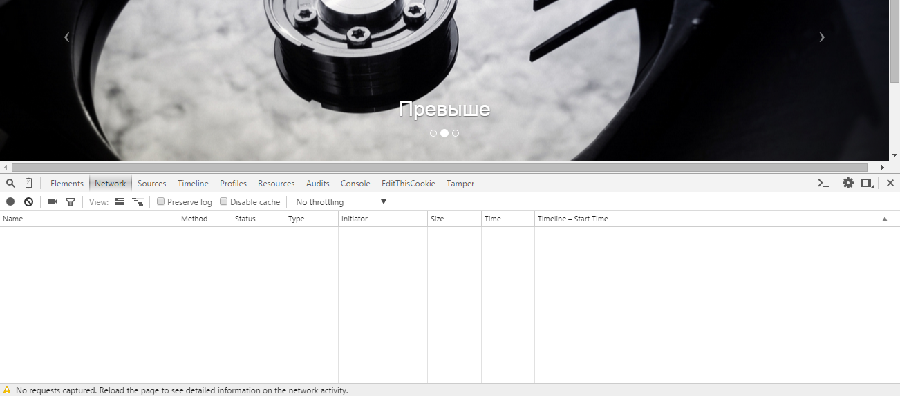
Обновляем страницу и наблюдаем:
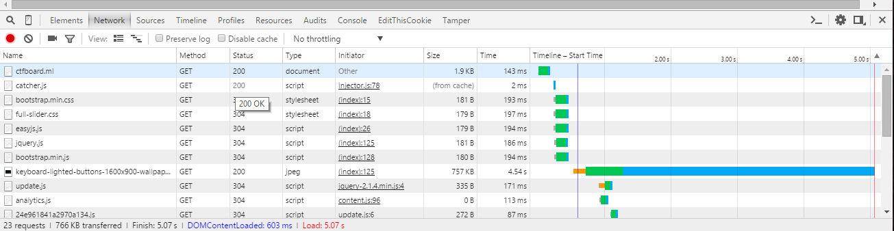
Далее сразу обращаем внимание на файл "easy.js"
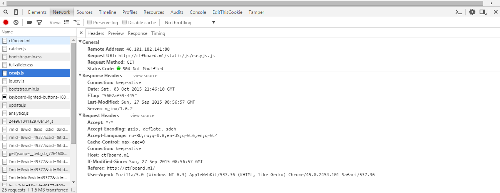
жмакнув по нему, мы получаем информацию о хедерах: на какой адрес мы отправляли запрос, какой запрос, какой метод использовали, статус ответа, дата и время, с какого клиента был сделан запрос, информацию о сервере и еще множество всего.
Также, перейдя в вкладку Response, мы можем увидеть ответ на наш запрос, в нашем случае это будет содержимое файла "easy.js"
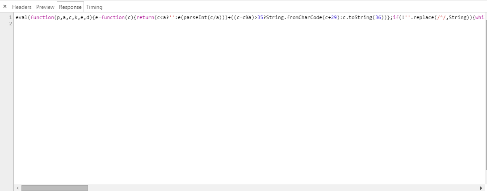
Ну и как далее решать этот таск вы уже знаете.
Рассмотрим еще пример использования панели Network - перейдем в /hiddensuperadminpanel.php:

Открываем Network:

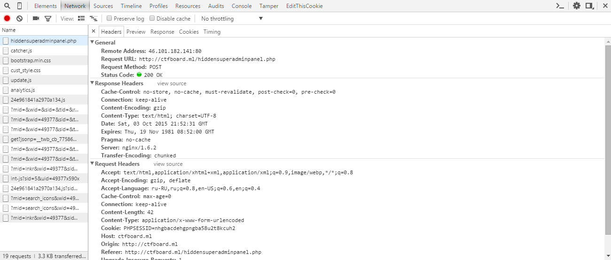

Сразу ну и видим, что хедеры немного поменялись - изменился запрос, т.к. тут нам нужно авторизоваться, то используется POST, сразу появились куки. А если мы попробуем залогиниться появится form data, которая покажет нам информацию, которую мы пытались ввести в форму авторизации:
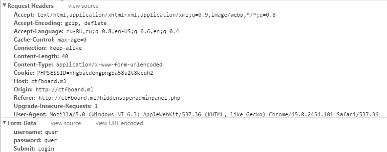

Если представить все, что там написано в форме POST-запроса, то он бы выглядел бы как:

> "username=qwer&password=qwer&submit=login"
