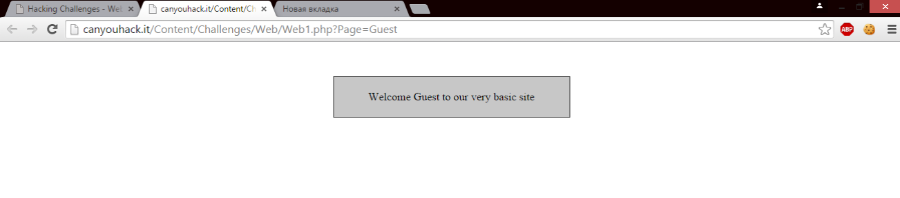
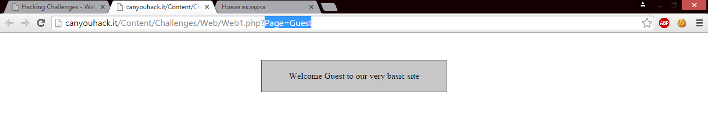
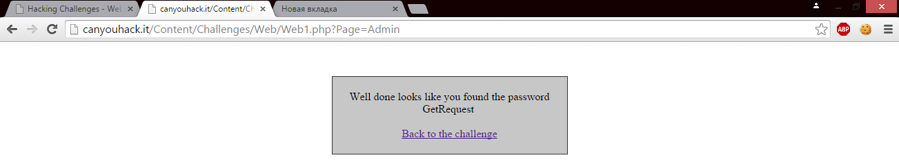

# HTTP
Этот протокол описывает взаимодействие между двумя компьютерами (клиентом и сервером), построенное на базе сообщений, называемых запрос (Request) и ответ (Response). Каждое сообщение состоит из трех частей: стартовая строка, заголовки и тело. При этом обязательной является только стартовая строка.

Стартовые строки для запроса и ответа имеют различный формат — нам интересна только стартовая строка запроса, которая выглядит так:

METHOD URI HTTP/VERSION,

где METHOD — это как раз метод HTTP-запроса, URI — идентификатор ресурса, VERSION — версия протокола (на данный момент актуальна версия 1.1).

Заголовки — это набор пар имя-значение, разделенных двоеточием. В заголовках передается различная служебная информация: кодировка сообщения, название и версия браузера, адрес, с которого пришел клиент (Referrer) и так далее.

Тело сообщения — это, собственно, передаваемые данные. В ответе передаваемыми данными, как правило, является html-страница, которую запросил браузер, а в запросе, например, в теле сообщения передается содержимое файлов, загружаемых на сервер. Но как правило, тело сообщения в запросе вообще отсутствует.

Пример HTTP-взаимодействия

Рассмотрим пример.

Запрос:
GET /index.php HTTP/1.1
Host: example.com
User-Agent: Mozilla/5.0 (X11; U; Linux i686; ru; rv:1.9b5) Gecko/2008050509 Firefox/3.0b5
Accept: text/html
Connection: close

Первая строка — это строка запроса, остальные — заголовки; тело сообщения отсутствует

Ответ:
HTTP/1.0 200 OK
Server: nginx/0.6.31
Content-Language: ru
Content-Type: text/html; charset=utf-8
Content-Length: 1234
Connection: close

... САМА HTML-СТРАНИЦА ...

Ресурсы и методы

Вернемся к стартовой строке запроса и вспомним, что в ней присутствует такой параметр, как URI. Это расшифровывается, как Uniform Resource Identifier — единообразный идентификатор ресурса. Ресурс — это, как правило, файл на сервере (пример URI в данном случае '/styles.css'), но вообще ресурсом может являться и какой-либо абстрактный объект ('/blogs/webdev/' — указывает на блок «Веб-разработка», а не на конкретный файл).

Тип HTTP-запроса (также называемый HTTP-метод) указывает серверу на то, какое действие мы хотим произвести с ресурсом. Изначально (в начале 90-х) предполагалось, что клиент может хотеть от ресурса только одно — получить его, однако сейчас по протоколу HTTP можно создавать посты, редактировать профиль, удалять сообщения и многое другое. И эти действия сложно объединить термином «получение».

Для разграничения действий с ресурсами на уровне HTTP-методов и были придуманы следующие варианты:
GET — получение ресурса
POST — создание ресурса
PUT — обновление ресурса
DELETE — удаление ресурса

Обратите внимание на тот факт, что спецификация HTTP не обязывает сервер понимать все методы (которых на самом деле гораздо больше, чем 4) — обязателен только GET, а также не указывает серверу, что он должен делать при получении запроса с тем или иным методом. А это значит, что сервер в ответ на запрос DELETE /index.php HTTP/1.1 не обязан удалять страницу index.php на сервере, так же как на запрос GET /index.php HTTP/1.1 не обязан возвращать вам страницу index.php, он может ее удалять, например :)

Рассмотрим пример решения таска с использованием GET-запроса:
Таск называется "Can you GET this one?" из этого уже можно сделать кое-какие выводы:)
Итак, открыв таск мы видим:

Немного изучив содержимое таска, можно обратить внимание на URL:

Если воспользоваться мозгами, то приходит понимание, что стоит воспользоваться волшебный словом "Admin":

Отправляем запрос и получаем результат:

Получили флаг, а позже за флаг и очки.
