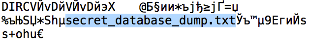

# .git

Чаще всего если вы в ctf таске (или в боевых условиях) встречаете папку .git, то обычно на нее права 403 и запрещенный листинг.  
Опишу какие файлы находятся в этой папке
```
|-- COMMIT_EDITMSG
|-- FETCH_HEAD
|-- HEAD
|-- ORIG_HEAD
|-- branches
|-- config
|-- description
|-- hooks
|   |-- applypatch-msg
|   |-- commit-msg
|   |-- post-commit
|   |-- post-receive
|   |-- post-update
|   |-- pre-applypatch
|   |-- pre-commit
|   |-- pre-rebase
|   |-- prepare-commit-msg
|   `-- update
|-- index
|-- info
|   `-- exclude
|-- logs
|   |-- HEAD
|   `-- refs
|-- objects
`-- refs
    |-- heads
    |-- remotes
    |-- stash
    `-- tags
```

__Описание файлов__

Мы рассмотрим самые важные файлы.
Некоторая информация была взята со статьи http://habrahabr.ru/post/143079/

__index__

В этом файле находится перечисление всех файлов данной директории.  
Пример:  


__config__

Как вы уже поняли в нем находятся конфигурации данного репозитория.  
Пример:

```
[core]
    repositoryformatversion = 0
    filemode = true
    bare = false
    logallrefupdates = true
```

__description__

Файл описания данного репозитория.  
Пример(файл пуст):
```
    Unnamed repository; edit this file 'description' to name the repository.
```

__HEAD__

Файл со ссылкой на текущую ветку (чаще всего ref: refs/heads/master)  
Пример(файл по умолчанию):
```
    ref: refs/heads/master
```

__COMMIT_EDITMSG__

Файл с последним комментарием последнего редактора (опять же не часто используется, но в некоторых ctf может помочь)  
Пример(файл по умолчанию):
```
# Please enter the commit message for your changes. Lines starting
# with '#' will be ignored, and an empty message aborts the commit.
# Explicit paths specified without -i or -o; assuming --only paths...
#
# Committer: is_work <is_work@is.lan>
#
# On branch master
#
# Initial commit
#
# Changes to be committed:
#	new file:   secret_database_dump.txt
#
```

__logs/HEAD__

Файл с историей редактирования кода  
Пример:
```
0000000000000000000000000000000000000000 3c4992205aba2077cbf87fc7cde900fabecd1140 root <root@ip-172-31-10-205.ap-southeast-2.compute.internal> 1412673432 +0000commit (initial): Hurr durr
3c4992205aba2077cbf87fc7cde900fabecd1140 ec972f9af79a09129021a30e7f08099aa2b8a81d John Doe <fsck@you.me> 1412673456 +0000   commit (amend): Hurr durr
ec972f9af79a09129021a30e7f08099aa2b8a81d 0b4d6fe0adf809c4e7b7a0d47132600b68f79fda root <root@ip-172-31-10-205.ap-southeast-2.compute.internal> 1417230572 +0000commit: My precious flag now exists
```

## Утилиты

Утилита, помогающая в данной ситуации https://github.com/kost/dvcs-ripper  
Также, утилита для парсинга .git/index : https://github.com/sbp/gin


----
взято с сайта http://itsecwiki.org/