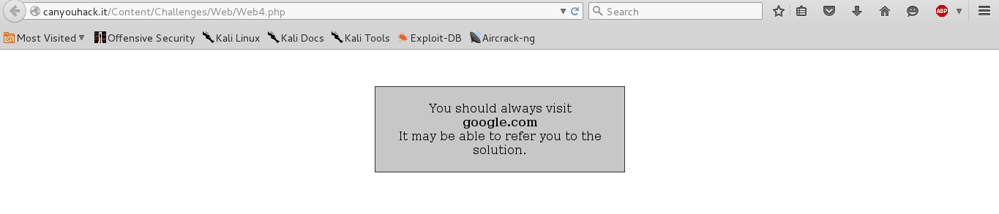
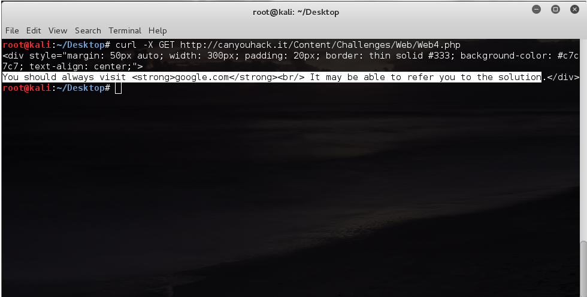
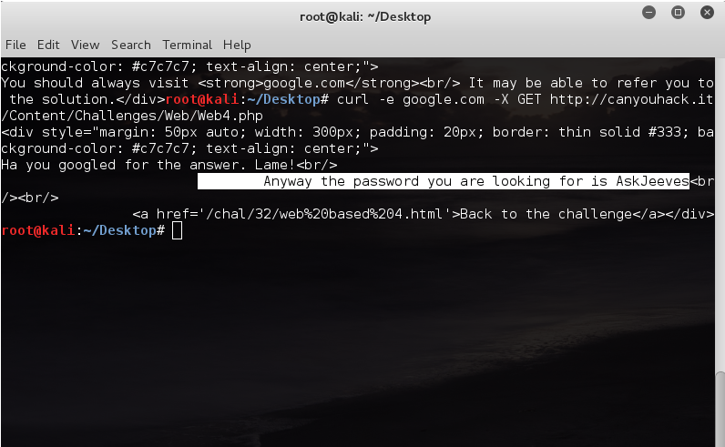

# HTTP Headers

Заголовки HTTP (англ. HTTP Headers) — это строки в HTTP-сообщении, содержащие разделённую двоеточием пару имя-значение. Формат заголовков соответствует общему формату заголовков текстовых сетевых сообщений ARPA. Заголовки должны отделяться от тела сообщения хотя бы одной пустой строкой.
Все заголовки разделяются на четыре основных группы:

 1.  General Headers (рус. Основные заголовки) — должны включаться в любое сообщение клиента и сервера.
 2.  Request Headers (рус. Заголовки запроса) — используются только в запросах клиента.
 3. Response Headers (рус. Заголовки ответа) — только для ответов от сервера.
 4. Entity Headers (рус. Заголовки сущности) — сопровождают каждую сущность сообщения.

----------

**Основные заголовки**

Основные заголовки (англ. General Headers) являются основными для запросов клиента и ответов сервера. Большая часть из них являются обязательными.

**Заголовки запроса**

Заголовки запроса (англ. Request Headers) используются только в запросах клиента.
Referer
Полный или относительный URI ресурса, с которого клиент сделал текущий запрос. Если указан относительный, то полный определяется по запрашиваемому URI. Клиенты не должны включать в значение Referer указатель фрагмента (часть URI после символа решетки «#»). Также нельзя включать ссылки на ресурсы, не имеющие собственного URI (например, ввод адреса с клавиатуры).

Примеры:

    Referer: http://www.example.com/ — полный URI к корню сайта.
    Referer: http://www.example.org/send-message.php?to=support — пример с параметрами.
    Referer: /news/2007/08/23/ — указание относительного URI.
    Referer: http://127.0.0.1/foo/bar-rules.html — такой вариант допустим.
    Referer: ftp://storage.example.com/archive/foo-notes.htm — переход не с HTTP-ресурса.

User-Agent
Указывает программное обеспечение клиента и его характеристики. Аналогичным ему является Server для серверов и Via для прокси.
Заголовки ответа

**Заголовки ответа**

Заголовки ответа (англ. Response Headers) включаются только в ответы сервера.
Allow

Список поддерживаемых методов всего сервера или конкретного ресурса. Посылается сервером вместе со статусами 405 и 501, а также в ответе на метод OPTIONS.

Пример: Allow: GET, HEAD, OPTIONS
Заголовки сущности

**Заголовки сущности**
Заголовки сущности (англ. Entity Headers) — заголовки, сопровождающие каждую сущность как в запросах клиента, так и в ответах сервера. Тем не менее, наличие некоторых бессмыслено в заголовках запросов (например, Expires). В отдельный класс заголовки сущности выделены для того, чтобы не путать их с заголовками запроса или заголовками ответа при передаче множественного содержимого (multipart/*). Заголовки запроса и ответа как и основные заголовки описывают всё сообщение в целом и размещаются только в начальном блоке заголовков, в то время как заголовки сущности характеризуют содержимое каждой части в отдельности располагаясь непосредственно перед её телом.

Content-Language
Указывает один или несколько естественных языков содержимого, для носителей которых оно предназначается. Языки перечисляются через запятую, порядок значения не имеет. Если данный заголовок опущен, то предполагается, что содержимое предназначено для людей, понимающих любой язык (или же язык вообще значения не имеет). При этом возможно, что человек не отыщет там информацию на понятном ему языке.

Обратите внимание, что в этом поле следует указывать не все используемые в документе языки, а только те, которые, по вашему мнению, понимает конечный пользователь. Например, если это страница учебника по английскому языку для русскоговорящей аудитории, то указывать следует только русский язык, так как для англоговорящих людей она не нужна. А если это страница с сообщением об ошибке на двух языках, то указывать нужно оба.

----------

Рассмотрим пример решения тасков:
Для решения этого таска использовалась утилита cURL.

> cURL — свободная (распространяемая по лицензии MIT)[4],
> кроссплатформенная служебная программа командной строки, позволяющая
> взаимодействовать с множеством различных серверов по множеству
> различных протоколов с синтаксисом URL. Программа cURL может
> автоматизировать передачу файлов или последовательность таких
> операций. Например, это хорошее средство для моделирования действий
> пользователя в веб-обозревателе.
>
> Программа поддерживает протоколы: FTP, FTPS, HTTP, HTTPS, TFTP, SCP,
> SFTP, Telnet, DICT, LDAP, а также POP3, IMAP и SMTP. Также cURL
> поддерживает сертификаты HTTPS, методы HTTP POST, HTTP PUT, загрузку
> на FTP, загрузку через формы HTTP.
>
> Поддерживаемые методы аутентификации: базовая, дайджест, NTLM и
> Negotiate для HTTP, а также kerberos4 для FTP.
>
> Возможно возобновление передачи файла с места обрыва (при поддержке
> протоколом), туннелирование через HTTP-прокси, поддержка HTTP-Cookie.

Итак, открываем таск
   Внимательно изучив содержимое таска, становится понятно, что решение будет связанно с Referer - заголовком запроса, который постоянно должен содержать "google.com". Воспользуемся cURL'ом: введем команду

> curl -X GET http://canyouhack.it/Content/Challenges/Web/Web4

ключ "-X" используется для того, чтобы указать какой запрос будет использоваться
результат выполнения команды:

Это только для того, чтобы убедиться, что мы получим тоже самое, что и на 1 картинке.
Далее изучив man'ы по cURL'у становится понятно, что чтобы изменить referer нужно воспользоваться ключом "-e" и указать нужный URL. Воспользуемся этим:

И получаем флаг "AskJeeves". Таск решен.
