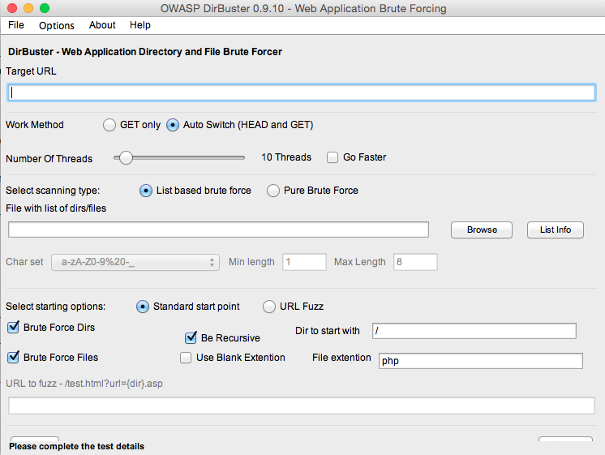
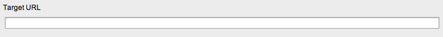
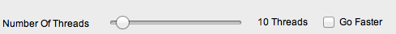
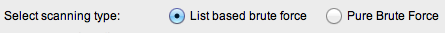
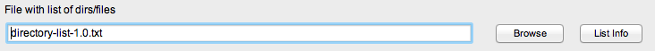
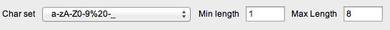

# OWASP DirBuster
__OWASP DirBuster__ - это приложение от кампании OWASP для перебора наличия файлов на веб сервере по спискам.
Расскажу вкратце как с ней работать.

## Устройство программы


__Target URL__ - url цели.  


__Work Method__ - обыкновенно для брута используются GET запросы (как в браузерах) - но в некоторых тасках могут помочь и POST запросы.  


__Number of threads__ - означает количество потоков.  


__Select scanning type__ - выбираем тип словаря, по которому будет осуществляться перебор. List based brute force - перебор по заранее подготовленным словарям. Pure Brute Force - перепор по автоматически-генерируемым словарям.  


__File with list of dirs/files__ - если в предыдущем пункте вы выбрали List based brute force, то тогда в этом пункте вам нужно указать по какому словарю будет идти перебор.  


__Char set, Min length, Max length__ - если вы выбирали Pure Brute Force, то этот пункт обозначает по какому регулярному выражению будет проходить генерация словаря.  


Далее идут настройки, которые и так понятны - нажимаете кнопку Start и ждете пока DirBuster пройдется по словарю.

## Dirbuster в CTF
Чем же так хорош DirBuster? А все дело в том, что он проходится именно перебором, а не как Spider по всем ссылкам страниц. То есть мы можем найти те файлы, которые не индексируются.

__Типы заданий__  
Приведу несколько примеров,когда dirbuster мне помог на CTF.

__Нахождение 'редких' файлов__  
В таких системах, как MacOS и Windows, для быстрого открытия файлов создаются такие файлы как .DS_Store или Thumbs.db.

__.DS_Store__ - является скрытым системным файлам, который создается системой автоматически в каждой папке. Он содержит различные метаданные и атрибуты родительских папок, например, расположение и отображение объектов в папке, размер иконок и т.п.

__Thumbs.db__ - это скрытый файл создается в каждой папке Windows, которая содержит изображения, при первом отображении её содержимого. В Thumbs.db помещаются данные об уменьшенных копиях изображений форматов JPEG, BMP, GIF, TIF, PDF и HTML. (источник - http://www.winline.ru/articles/Udalenie_faylov_DS_Store_i_Thumbs_db_iz_OS_X.php)

Чем же это нам поможет? А тем, что врят ли все проверяют наличие таких файлов (лично я встречал только один-два раза). А эта DirBuster почти в каждом словаре (кроме генерируемых) имеет такие файлы. Если в общем - позволяет искать очень много аналогичных 'редких файлов'

*__Пример 1__*  
Один из тасков,который мне встречался, был по вебу: нам дали url сайта. Вычислить на чем работает не получалось (все заголовки, fingerprint'ы были удалены).  
Как тут решать нужно было:
```
1. Запускаем DirBuster на сайт с минимальным словарем (это все таки ctf:)
2. Ждем несколько минут.
3. Замечаем файл .DS_Store, скачиваем его.
4. С помощью hexedit получаем списки файлов в директории (они будут явно видны среди нечитаемых символов.
5. Находим файл типа flagflag.txt
6. Profit!
```

__Поиск стандартных папок__  
В этой категории уже идет поиск файлов, достаточно популярных среди ctf - такие файлы, папки как backups, admin и тд..  
Почему я вынес в отдельную категорию? Все просто: такие задания часто встречаются, и их нельзя охарактеризовать как 'редкие' или типичные файлы.  
Давайте посмотрим на примеры:

*__Пример 1__*  
```
1. Запускаем DirBuster на сайт с минимальным словарем.
2. Ждем несколько минут.
3. Замечаем файл backup.tar.gz, скачиваем его и разархивируем.
4. Получаем бекап целого сайта.
5. Видим папку /superadmin/index.php и сам файл, который связывается с БД (из-вне не доступна).
6. Заходим по адресу на сайте и получаем флаг.
7. Profit!
```

## Полезные ссылки
> * https://www.owasp.org/index.php/Category:OWASP_DirBuster_Project
> * http://sourceforge.net/projects/dirbuster/
> * http://sectools.org/tool/dirbuster/


----
взято с сайта http://itsecwiki.org/
