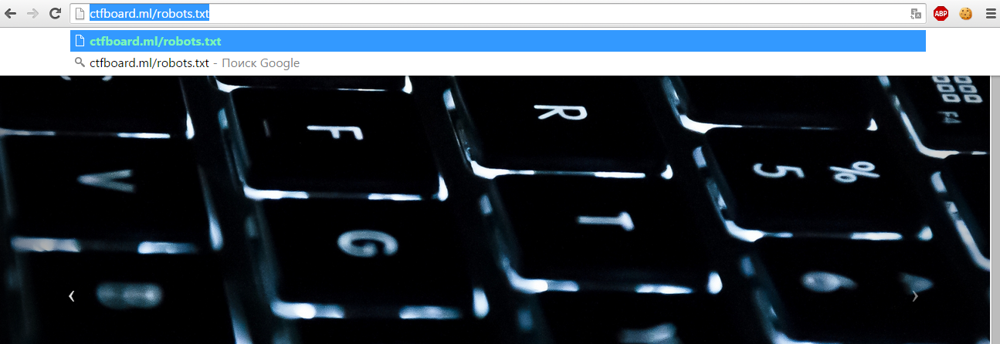
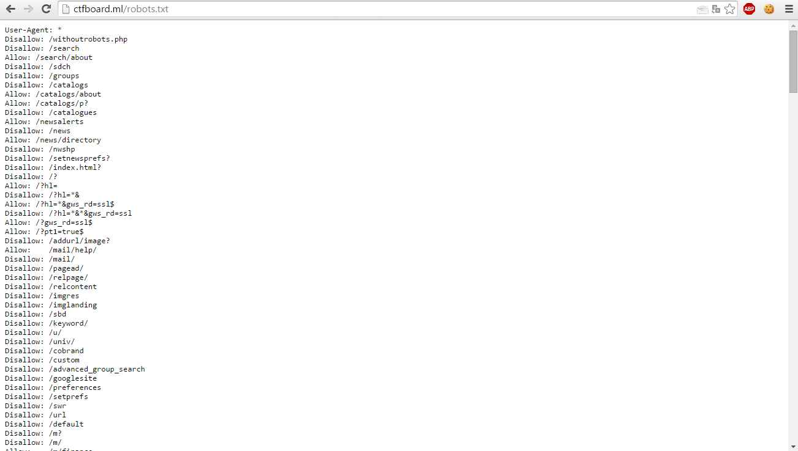
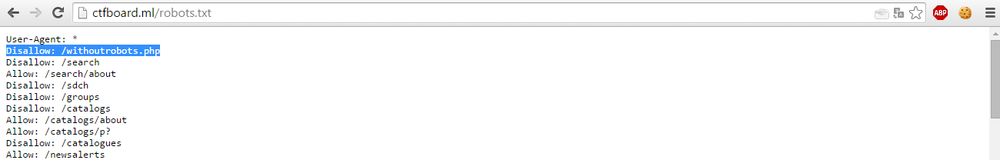
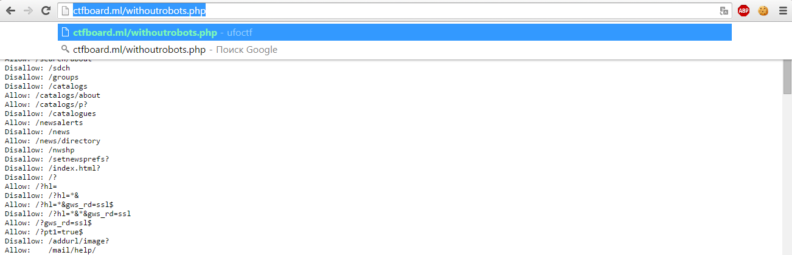
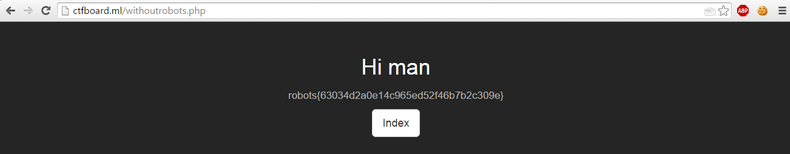

# robots.txt
Стандарт исключений для роботов (robots.txt) — файл ограничения доступа к содержимому роботам на http-сервере. Файл должен находиться в корне сайта (то есть иметь путь относительно имени сайта /robots.txt). При наличии нескольких поддоменов файл должен располагаться в корневом каталоге каждого из них.

Файл robots.txt используется для частичного управления индексированием сайта поисковыми роботами. Этот файл состоит из набора инструкций для поисковых машин, при помощи которых можно задать файлы, страницы или каталоги сайта, которые не должны индексироваться.

**Описание структуры**
Файл состоит из записей. Записи разделяются одной или более пустых строк (признак конца строки: символы CR, CR+LF, LF). Каждая запись содержит непустые строки следующего вида:

> <поле>:<необязательный пробел>
> <значение><необязательный пробел>

где поле — это либо User-agent, либо Disallow.
**Примеры**
Запрет доступа всех роботов ко всему сайту:

> User-agent: *  Disallow: /

Запрет доступа определенного робота к каталогу /private/:

>  User-agent: googlebot
>  Disallow: /private/

**Нестандартные директивы**
Crawl-delay: устанавливает время, которое робот должен выдерживать между загрузкой страниц. Если робот будет загружать страницы слишком часто, это может создать излишнюю нагрузку на сервер. Впрочем, современные поисковые машины по умолчанию задают достаточную задержку в 1-2 секунды.

>  User-agent: *
>    Crawl-delay: 10

Allow: имеет действие, обратное директиве Disallow — разрешает доступ к определенной части ресурса. Поддерживается всеми основными поисковиками. В следующем примере разрешается доступ к файлу photo.html, а доступ поисковиков ко всей остальной информации в каталоге /album1/ запрещается.

>  Allow: /album1/photo.html
>   Disallow: /album1/

**Решение тасков**
Итак, открываем таск и видим:

Обращаем внимание на название и описание к таску - "Are you robot?". Так, обычно, организаторы пытаются указать нам путь решения, и, я думаю, что после такой подсказки  вариантов решение остается немного:)
Далее переходим по ссылке указанной в задании:

Ну и далее пробуем воспользоваться подсказкой из задания:

Смотрим файл robots.txt

Видим очень много записей, часть которых просто попытка запутать людей, решающих этот таск. Ну и сразу обращаем внимание на 1 запись:

Это запись означает, что файл wihtoutrobots.php не должен индексироваться какими-либо поисковыми роботами, т.е. кто-то очень хотел его спрятать, но сделал это не так, как надо было:)
Переходим к этому файлу:

Ну и получаем флаг. Таск решен.
