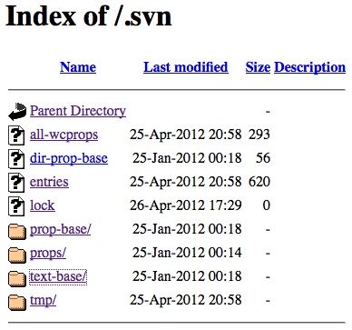
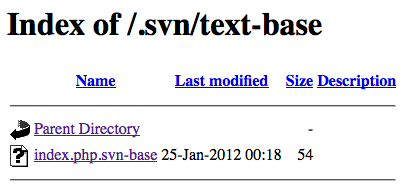
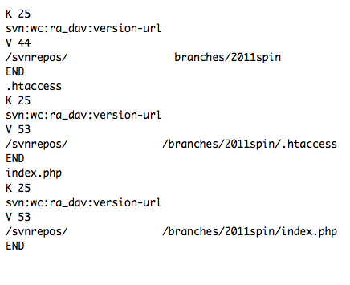
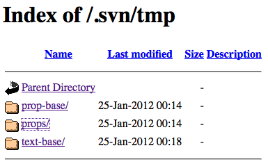

# .svn

__.svn__ - папка, встречающаяся уже реже, чем .git, поэтому информация тут не полная.

## Описание файлов

Список файлов в корневой директории:  

__Папки text-base и prop-base__  
В папке __text-base__ и __prop-base__ вы можете получить исходники всех файлов, синхронизирующихся с svn.  
Пример файлов в папках:  

__Файл all-wcprops__  
__all-wcprops__ отвечает за версии файлов. Лично нам интересен только тем, что предоставляет пути.  
Пример содержимого файла:  

__Файл dir-prop-base__  
Честно говоря, не думаю что он чем то полезен для нас. Как я понял файл ответственный за настройки к каждой системной папке.

__Файл entries__  
Файл очень схож с файлом index в папках .git - отвечает за список файлов и папок и так же хранит их md5  

__Файл lock__  
Файл был пустым, поэтому могу только предположить, что в нем прописываются какие либо блокировки по синхронизации.

__Папка tmp__  
Папка отвечает за временное хранение файлов.  
Содержимое папки:  

Папки пустые, но на ctf вполне могут дать таски, связанные с ними.

## Утилиты

Утилита, помогающая скачиванию файлов https://github.com/kost/dvcs-ripper

## Статьи и полезные ссылки

http://habrahabr.ru/post/70330/ - описание процесса  
https://pythonconquerstheuniverse.wordpress.com/2011/03/16/learning-subversion-the-mystery-of-svn-2/ - описание файлов  
http://resources.infosecinstitute.com/hacking-svn-git-and-mercurial/

----
взято с сайта http://itsecwiki.org/
